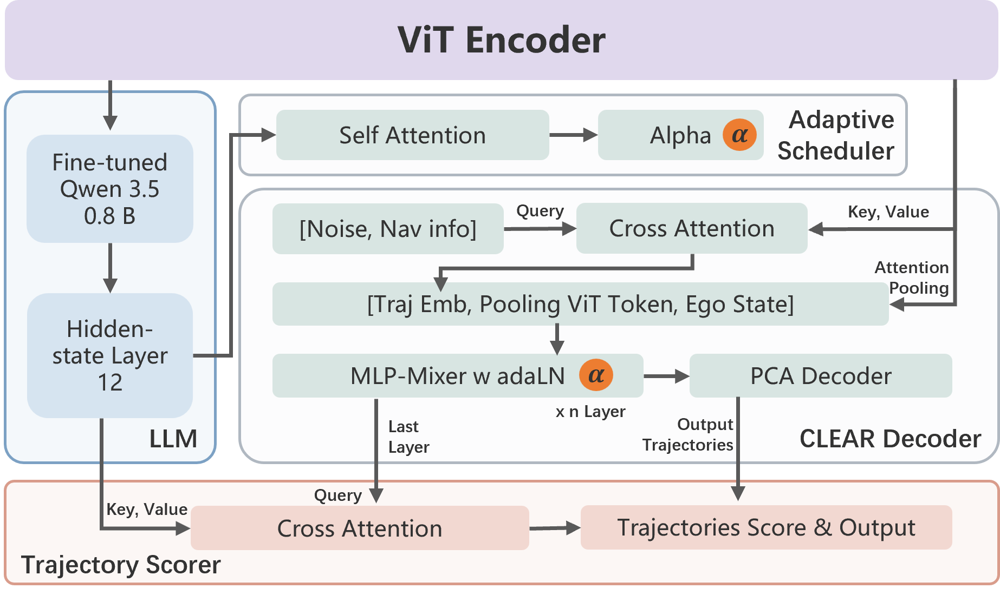
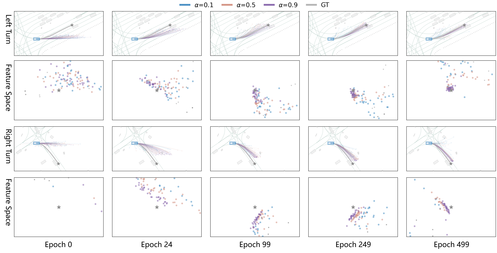

# CLEAR

CLEAR combines a frozen Drive-JEPA visual encoder, a fine-tuned Qwen 3.5 0.8B semantic encoder, and a single-step latent trajectory generator. The paper's central move is to replace iterative diffusion denoising with one conditional drift step in a VAE trajectory-latent space, then use LLM hidden states to decide how much diversity to generate and which candidate to execute.

**Source**: `raw/papers/CLEAR_ Cognition and Latent Evaluation for Adaptive Routing in End-to-End Autonomous Driving.md`
**arXiv**: https://arxiv.org/html/2606.06219v1
**Authors**: Yining Xing, Zehong Ke, Zhiyuan Liu, Yanbo Jiang, Wenhao Yu, Jianqiang Wang

## Key Takeaways

- CLEAR reports 93.7 PDMS on NAVSIM-v1, narrowly above DriveSuprim 93.5 and Drive-JEPA 93.3 in the paper's table.
- The planner is not a standard diffusion sampler: it performs single-step conditional drift in a VAE latent space and decodes through a frozen PCA basis fitted on expert trajectories.
- The conditioning coefficient `alpha` interpolates between diverse geometric coverage (`alpha` near 0) and expert-like precision (`alpha` near 1).
- Qwen 3.5 0.8B is used as a hidden-state feature extractor, not as a text trajectory generator. Its hidden states drive both the Adaptive Scheduler and Cross-Attention Scorer.
- Adaptive scheduling chooses a discrete `(alpha, N)` sampling scheme from a predefined grid, so hard scenes get more candidates and more diversity while simple scenes use lower compute.
- The Cross-Attention Scorer ranks generated candidates against LLM hidden states using PDMS-derived supervision.
- NAVSIM-v2 EPDMS is 88.6. This is strong in the paper's ViT/L comparison, but it is below the wiki's stronger v2 entries such as WAM-Diff / DriveFine bug-fixed 89.7, Vega BoN-6 89.4, and Latent-WAM 89.3.

## Method

### Architecture

CLEAR takes front-view images, ego history, and a navigation command. A frozen Drive-JEPA encoder extracts visual/geometric features. A fine-tuned Qwen 3.5 0.8B model encodes driving QA context into hidden states. The Adaptive Scheduler predicts a discrete sampling scheme `(alpha, N)`, the MLP-Mixer CLEAR Decoder generates `N` candidates in one batched pass, and the Cross-Attention Scorer selects the final trajectory.

**Figure 1.** CLEAR architecture: Drive-JEPA and Qwen features feed the scheduler, single-step drift decoder, and LLM-conditioned candidate scorer.

### Single-Step Conditional Drift

The trajectory generator works in a VAE latent space. A trajectory VAE is pretrained with an auxiliary maneuver classification head, then the encoder is frozen. Physical waypoints are decoded through a PCA projection fitted on expert demonstrations, which acts as a low-pass kinematic constraint.

For each candidate, the drift target combines:

- an attractive term between an assigned positive trajectory latent and the ground-truth latent;
- a repulsive term against the other generated candidates' VAE encodings;
- a Winner-Take-All loss on the candidate closest to the ground truth.

The scalar `alpha` controls the precision/diversity trade-off. Low `alpha` emphasizes multi-modal coverage of feasible positives; high `alpha` pulls candidates tightly toward the expert trajectory.

**Figure 2.** Training evolution across physical and latent spaces. Low `alpha` keeps broad feasible coverage, high `alpha` converges around the expert trajectory, and intermediate `alpha` balances both.

### Adaptive Routing and Scoring

The Adaptive Scheduler maps Qwen hidden states to a categorical distribution over predefined `(alpha, N)` schemes. Supervision is obtained by evaluating all candidate schemes with the official PDMS scorer and labeling each scene with the best-performing scheme.

The Cross-Attention Scorer treats trajectory features as queries and LLM hidden states as memory. It predicts candidate scores trained with pairwise hinge ranking plus MSE against per-candidate PDMS. This makes CLEAR closer to a learned deployable selector than to oracle Best-of-N: it still generates multiple candidates, but selection is learned from hidden-state-conditioned scoring rather than invoking the simulator at inference.

## Results

### NAVSIM-v1

| Method         |       NC |      DAC |   EP | Comf. |      TTC |     PDMS |
| -------------- | -------: | -------: | ---: | ----: | -------: | -------: |
| GoalFlow       |     98.4 |     98.3 | 85.0 |   100 |     94.6 |     90.3 |
| DiffusionDrive |     98.2 |     96.2 | 82.2 |   100 |     94.7 |     88.1 |
| ReCogDrive     |     97.9 |     97.3 | 87.3 |   100 |     94.9 |     90.8 |
| iPad           |     98.6 |     98.3 | 88.0 |   100 |     94.9 |     91.7 |
| DriveSuprim    |     98.6 |     98.6 | 91.3 |   100 |     95.5 |     93.5 |
| Drive-JEPA     |     99.1 |     98.2 | 90.8 |  99.9 |     95.9 |     93.3 |
| **CLEAR**      | **99.1** | **98.8** | 89.7 |  99.6 | **97.2** | **93.7** |

The gain over DriveSuprim is small (+0.2 PDMS) but comes with notably higher TTC (97.2 vs. 95.5) and DAC (98.8 vs. 98.6), while ego progress is lower (89.7 vs. 91.3).

### NAVSIM-v2

| Method | Backbone | NC | DAC | DDC | TL | EP | TTC | LK | HC | EC | EPDMS |
| --- | --- | ---: | ---: | ---: | ---: | ---: | ---: | ---: | ---: | ---: | ---: |
| DriveSuprim | ViT/L | 98.4 | 98.6 | 99.6 | 99.8 | 90.5 | 97.8 | 97.0 | 98.3 | 78.6 | 87.1 |
| Drive-JEPA | ViT/L | 98.4 | 98.6 | 99.1 | 99.8 | 88.4 | 97.8 | 97.6 | 97.9 | 84.8 | 87.8 |
| **CLEAR** | **ViT/L** | **99.0** | **98.7** | **99.6** | 96.9 | **91.0** | **98.4** | 92.9 | 96.4 | 79.5 | **88.6** |

CLEAR improves EPDMS over Drive-JEPA and DriveSuprim in its local comparison set, mostly through NC, DAC, EP, and TTC. The weakness is clear: TL, LK, HC, and EC trail the stronger entries in the same table.

### Ablation

| Variant | LLM Scorer | Adaptive | NC | DAC | EP | Comf. | TTC | PDMS |
| --- | --- | --- | ---: | ---: | ---: | ---: | ---: | ---: |
| a | no | no | 98.9 | 98.8 | 88.4 | 99.7 | 97.2 | 93.1 |
| b | yes | no | 99.1 | 98.9 | 88.6 | 99.7 | 97.1 | 93.3 |
| c | yes | yes | 99.1 | 98.8 | 89.7 | 99.6 | 97.2 | 93.7 |

The LLM scorer contributes +0.2 PDMS, and adaptive scheduling adds another +0.4 PDMS mainly through ego progress.

## Relationships

- **Drive-JEPA**: CLEAR uses Drive-JEPA as its frozen visual encoder, then adds latent drift generation and Qwen-conditioned scheduling/scoring. Drive-JEPA's own proposal scorer is vision/proposal based; CLEAR explicitly brings LLM hidden states into both candidate budget selection and ranking.
- **DiffusionDrive / diffusion planners**: CLEAR targets the same multi-modal planning problem as diffusion methods but avoids iterative denoising. It is a single-step latent drift generator, so the relevant trade-off is whether one learned drift can preserve enough multi-modal coverage without diffusion refinement.
- **DriveSuprim / selection-based planning**: CLEAR is not a fixed-vocabulary selector. It generates candidates online, then uses a learned scorer; this makes it adjacent to deployable selection and Best-of-N ideas, but the candidate source is generative rather than an 8192-entry library.
- **ReCogDrive-style cognitive planners**: CLEAR shares the idea that LLM hidden states are useful for driving semantics, but avoids using the LLM as a direct action generator.

## Limitations

- The Adaptive Scheduler chooses from a discrete `(alpha, N)` grid, so the optimum may lie between predefined schemes.
- The training pipeline is complex: VAE pretraining, PCA fitting, CLEAR decoder training, Qwen full fine-tuning, scheduler training, and scorer training are decoupled phases.
- Scheduler and scorer labels depend on PDMS evaluation over sampled pools, so the method inherits simulator/scorer bias.
- NAVSIM-v2 weaknesses are material: TL 96.9 and LK 92.9 are below DriveSuprim and Drive-JEPA in the same table, and EC 79.5 is far below Drive-JEPA 84.8.
- Generalization beyond NAVSIM is not established in the source markdown: no Bench2Drive, nuScenes, Waymo, HUGSIM, or NavHard result is reported.
