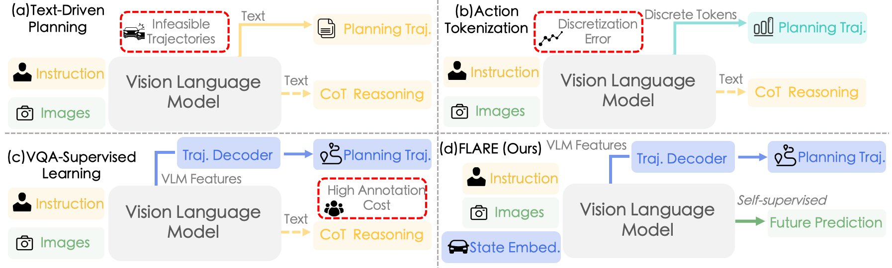
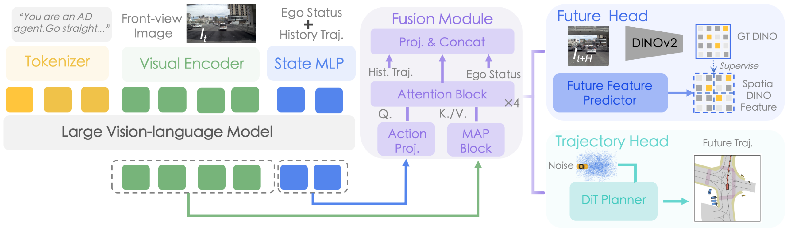
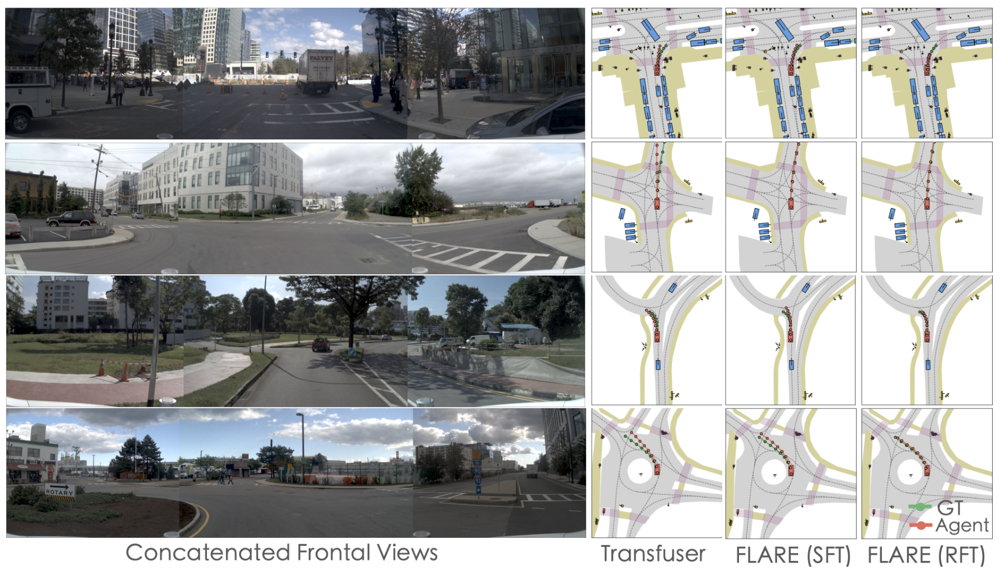

**arXiv**: 2601.05611v2  
**Org**: OpenDriveLab + Li Auto (supported by HK Jockey Club JC STEM Lab)  
**Benchmark highlight**: 86.9 PDMS SFT / 91.4 PDMS RFT single-sample NAVSIM-v1; 86.3 EPDMS NAVSIM-v2

---

## Problem: Annotation Cost + Modality Mismatch

FLARE identifies two structural problems with current VLM-based driving:

1. **Annotation cost with diminishing returns**: VQA/CoT label pipelines are expensive, and scaling QA pairs yields marginal gains (ReCogDrive ablation: 3.1M high-quality samples give only modest improvements over less data)
2. **Modality mismatch**: discrete linguistic tokens cannot capture continuous, non-verbalizable driving nuances. Action tokenization provides only sparse supervision signals that underutilize VLM parameter capacity

**Proposed fix**: replace language supervision with self-supervised **future DINOv2 spatial feature prediction** as a dense, continuous auxiliary objective — no language annotations needed, scalable to unlabeled video.

*Figure 1: (a) Text-driven methods generate infeasible trajectories. (b) Action tokenization introduces discretization errors and sparse supervision. (c) Feature-based methods require costly VQA/Caption annotations. (d) FLARE: self-supervised future feature prediction from unlabeled video.*

---

## Architecture

**Backbone**: Qwen3-VL-4B (4.6B parameters) with LoRA (r=8, α=16) on attention layers  
**Input**: front-view camera only (1 camera)  
**Modalities**: image + navigation command text + ego-state (velocity, acceleration, historical trajectory)

### Input Encoding

Three modalities unified into a token sequence fed to the VLM:
- Visual tokens $T_\text{vis}$ from SigLIP-2 encoder
- Language tokens $T_\text{lang}$ from navigation command
- Ego-state tokens $T_\text{state}$ from State MLP (LayerNorm + GELU), appended to the sequence

$$\mathbf{H} = \text{VLM}([T_\text{vis}; T_\text{lang}; T_\text{state}]) \in \mathbb{R}^{(K+M+S) \times d_\text{llm}}$$

### Hierarchical Two-Stage MAP Fusion

Rather than decoding directly from the full VLM output H, a two-stage Multimodal Attention Pooling (MAP) mechanism compresses it into a decision-centric vector:

**Stage 1 — Visual compression**:
$$\mathbf{V} = \text{MAP}_\text{vis}(\mathbf{H}) \in \mathbb{R}^{N_v \times d}$$
Extracts visual tokens from H, compresses to $N_v$ visual latents.

**Stage 2 — State-conditioned action query**:
$$\mathbf{e}_\text{state} = \text{ActionProj}(\mathbf{h}_\text{state}) \in \mathbb{R}^d$$
$$\mathbf{z} = \text{MAP}_\text{act}(\mathbf{V} \mid \mathbf{e}_\text{state}) \in \mathbb{R}^d$$
State embedding (from VLM's ego-state output token) initializes the query for the action MAP block — the visual aggregation is conditioned on vehicle dynamics and navigational intent. The result **z** is a single action decision vector.

### DiT Planner

Standard conditional DiT, denoising from Gaussian $\mathbf{x}_T$ to trajectory $\tau$:
$$\mathcal{L}_\text{traj} = \mathbb{E}_{t,\tau_0,\epsilon}[\|\epsilon - \epsilon_\theta(\mathbf{x}_t, t, \mathbf{z}, \mathbf{h}_\text{traj}, \mathbf{e}_\text{state})\|_2^2]$$

Conditioned on z (semantic intent), historical trajectory $\mathbf{h}_\text{traj}$, and current ego-state — all three grounding signals simultaneously.

### Future Feature Predictor (FFP)

Auxiliary head predicting DINOv2 spatial feature patches of the **future** frame:

1. Learnable spatial queries $\mathbf{Q}_s$ modulated by action intent **z** → intent-aware queries
2. Cross-attention over visual latents **V** → predicted semantic patches $\hat{\mathbf{F}} \in \mathbb{R}^{N_p \times d_f}$

Loss combining magnitude regression and directional alignment:
$$\mathcal{L}_\text{future} = \|\hat{\mathbf{F}} - \mathbf{F}_\text{gt}\|_1 + \alpha\left(1 - \frac{1}{N_p}\sum_j \text{CosSim}(\hat{\mathbf{F}}_j, \mathbf{F}_{\text{gt},j})\right)$$

**Key design**: conditioning FFP on **z** makes future prediction **action-conditional** — the model must simulate how its specific decision will change the scene (a form of mental simulation).

**Why DINOv2 features instead of pixels**: DINOv2 features capture semantic layout (road boundaries, objects) while being invariant to nuisance factors like lighting. Predicting semantic patches forces object permanence and motion logic learning, not just appearance reconstruction.

*Figure 2: FLARE architecture. VLM backbone (Qwen3-VL-4B + LoRA) processes image/text/state tokens. Hierarchical MAP fusion compresses to action decision vector z. Dual-head: DiT planner for trajectory, FFP for future DINOv2 patches. GRPO refines the policy.*

---

## Training

### Stage 1: Joint SFT

$$\mathcal{L}_\text{total} = \mathcal{L}_\text{traj} + \lambda \mathcal{L}_\text{future}, \quad \lambda = 0.1$$

- LoRA lr = 3×10⁻⁵; fusion + prediction heads lr = 1×10⁻⁴
- Cosine decay + 5% warmup; 80 epochs; 8×H100; batch 64

### Stage 2: Policy Refinement via GRPO

VLM backbone **frozen**; only fusion module + DiT planner updated.

Reward: $R(\tau) = w_p R_\text{progress} + w_s R_\text{safety} + w_c R_\text{comfort}$ (based on PDM-Score)

**Key design difference from standard GRPO**: uses **Behavior Cloning (BC) regularization** instead of KL divergence penalty:
$$\mathcal{L}_\text{total} = -\frac{1}{G}\sum_i \min(r_i(\theta)A_i, \text{clip}(r_i(\theta), 1-\epsilon, 1+\epsilon)A_i) + \lambda \mathcal{L}_\text{BC}$$
where $\mathcal{L}_\text{BC}$ explicitly anchors to the Stage 1 frozen reference policy. BC regularization is claimed to prevent policy collapse more reliably than KL divergence for diffusion planners.

- G = 16 trajectory samples per scene; DDIM with T'=5 denoising steps; lr = 2×10⁻⁵; 15 epochs

---

## Results

### Table 1: NAVSIM v1 navtest

**Non-VLM baselines (for reference):**

| Method | Sensors | PDMS |
|--------|---------|------|
| DiffusionDrive | 3 Cam + LiDAR | 88.1 |
| WoTE | 3 Cam + LiDAR | 88.3 |

**VLM-based SFT:**

| Method         | Sensors   | NC       | DAC      | TTC      | Comf.     | EP       | PDMS     |
| -------------- | --------- | -------- | -------- | -------- | --------- | -------- | -------- |
| QwenVL3-4B⋆    | 1 Cam     | 96.0     | 91.0     | 90.8     | 99.7      | 76.3     | 80.8     |
| ReCogDrive-2B  | 3 Cam     | 97.6     | 93.1     | 92.7     | 100.0     | 79.1     | 84.1     |
| ReCogDrive-2B† | 3 Cam     | 98.1     | 94.7     | 94.2     | 100.0     | 80.9     | 86.5     |
| ReCogDrive-8B† | 3 Cam     | 98.3     | 95.1     | 94.3     | 100.0     | 81.1     | 86.8     |
| **FLARE-4B**   | **1 Cam** | **98.2** | **95.0** | **93.9** | **100.0** | **81.8** | **86.9** |

⋆ Fine-tuned on navtrain trajectory data. † External pre-training datasets used.

FLARE-4B (86.9) surpasses ReCogDrive-8B† (86.8) using only 1 camera and no external pre-training. Compared to the QwenVL3-4B baseline: +6.1 PDMS.

**VLM-based RFT (single-sample):**

| Method | Sensors | NC | DAC | TTC | Comf. | EP | PDMS |
|--------|---------|-----|-----|-----|-------|----|------|
| AutoVLA-3B | 3 Cam | 98.4 | 95.6 | 98.0 | 99.9 | 81.9 | 89.1 |
| DriveVLA-W0 | 1 Cam | 98.7 | 99.1 | 95.3 | 99.3 | 83.3 | 90.2 |
| ReCogDrive-8B | 3 Cam | 97.8 | 97.7 | 94.9 | 100.0 | 86.3 | 90.5 |
| ReCogDrive-2B | 3 Cam | 97.9 | 97.3 | 94.9 | 100.0 | 87.3 | 90.8 |
| **FLARE-4B** | **1 Cam** | **98.5** | **98.4** | **96.0** | **100.0** | **86.0** | **91.4** |

**BoN-6 comparison (for context):**
- AutoVLA-3B BoN-6: 92.1; DriveVLA-W0 BoN-6: 93.0 (different inference strategy — not directly comparable to FLARE single-sample 91.4)

FLARE-4B (91.4) exceeds ReCogDrive-2B (90.8) and ReCogDrive-8B (90.5) under fair single-sample comparison. Perfect Comfort = 100.0.

### Table 2: NAVSIM v2 navtest (EPDMS)

| Method | NC | DAC | EP | TTC | HC | TL | DDC | LK | EC | EPDMS |
|--------|-----|-----|-----|-----|-----|-----|-----|-----|-----|-------|
| ARTEMIS | 98.3 | 95.1 | 81.5 | 97.4 | 100.0 | 99.8 | 98.6 | 96.5 | 98.3 | 83.1 |
| ReCogDrive-8B | 98.3 | 95.2 | 87.1 | 97.5 | 98.3 | 99.8 | 99.5 | 96.6 | 86.5 | 83.6 |
| DiffusionDrive | 98.0 | 96.0 | 87.7 | 97.1 | 98.3 | 99.8 | 99.5 | 97.2 | 87.6 | 84.3 |
| DriveVLA-W0 | 98.5 | 99.1 | 86.4 | 98.1 | 97.9 | 99.7 | 98.0 | 93.2 | 58.9 | 86.1 |
| **FLARE-4B** | **98.8** | **96.6** | **87.9** | **98.2** | **98.4** | **99.9** | **99.5** | **95.8** | **87.5** | **86.3** |

FLARE-4B claims 86.3 EPDMS. **Comparison scope caveat**: the table omits Senna-2 (86.6 EPDMS) and DriveDreamer-Policy (88.7 EPDMS), both of which exceed FLARE. Within the paper's comparison set, FLARE leads, but it is not the wiki SOTA on NAVSIM-v2. FLARE's EC = 87.5 is healthy — notably higher than DriveVLA-W0 (58.9) and DriveDreamer-Policy (79.4).

### Table 3: Future Feature Prediction Ablation

| Target | NC | DAC | TTC | Comf. | EP | PDMS |
|--------|-----|-----|-----|-------|----|------|
| None (pure traj.) | 97.6 | 92.5 | 92.8 | 100.0 | 78.1 | 83.4 |
| Image pixels | 97.7 | 93.7 | 93.5 | 100.0 | 78.9 | 84.7 |
| Global DINO feature | 98.1 | 94.2 | 93.6 | 100.0 | 80.8 | 85.9 |
| **Spatial DINO (ours)** | **98.2** | **95.0** | **93.9** | **100.0** | **81.8** | **86.9** |

Hierarchy: spatial DINO (+3.5 PDMS) > global DINO (+2.5) > pixels (+1.3) > none. Spatial granularity matters — preserving patch-level geometry captures fine-grained scene structure that global pooling discards.

### Table 4: Fusion Module Ablation

| Variant | NC | DAC | TTC | Comf. | EP | PDMS |
|---------|-----|-----|-----|-------|----|------|
| w/o MAP fusion (avg pool) | 97.7 | 93.8 | 93.4 | 100.0 | 79.6 | 85.0 |
| w/o state injection | 97.6 | 93.8 | 93.0 | 100.0 | 79.5 | 84.8 |
| **Two-stage MAP (full)** | **98.2** | **95.0** | **93.9** | **100.0** | **81.8** | **86.9** |

MAP fusion vs. global avg pool: +1.9 PDMS. State injection: +2.1 PDMS. Both are independently essential and complementary.

*Figure 3: FLARE-RFT (right column) vs. Transfuser (left) and FLARE-SFT (middle). Row 1: congested intersection — RFT decelerates/yields; SFT maintains speed and risks collision. Rows 3-4: curved roads and roundabouts — RFT generates smooth lane-centered trajectories.*

---

## Limitations

1. **Single camera only**: front-view only — no multi-camera spatial geometry, no depth information from stereo baseline. Cannot reason about lateral blind spots or precise 3D distance.

2. **NAVSIM-only evaluation**: no nuScenes, Bench2Drive, or Waymo evaluation. Generalization to other benchmarks unverified.

3. **EPDMS comparison scope gap**: FLARE's 86.3 EPDMS is below Senna-2 (86.6) and DDP (88.7), neither of which appear in Table 2. "SOTA" claim holds only within the paper's comparison set.

4. **No data scaling study**: the FFP objective is designed to scale to unlabeled video, but no experiment validates FLARE's performance trajectory with more data. This is the paper's stated future work.

5. **Single next-frame prediction**: FFP predicts only the immediately next frame. Whether multi-step future prediction (n=2,3 seconds ahead) provides additional benefit is not studied.

6. **SFT to RFT transfer**: only the fusion module and DiT planner are updated in Stage 2 (VLM frozen). Whether unfreezing the VLM backbone during RFT could further improve is not explored.

7. **BC regularization untested against KL**: the paper asserts BC regularization prevents collapse better than KL divergence for diffusion planners (citing DriveFine's reward hacking finding), but provides no ablation comparing the two regularization strategies.
