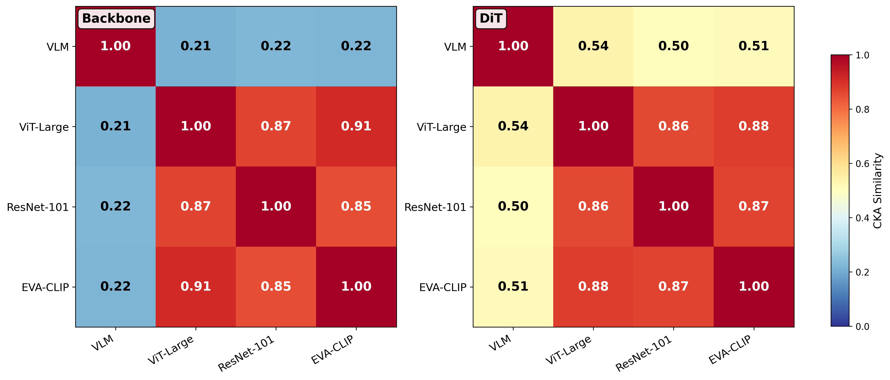
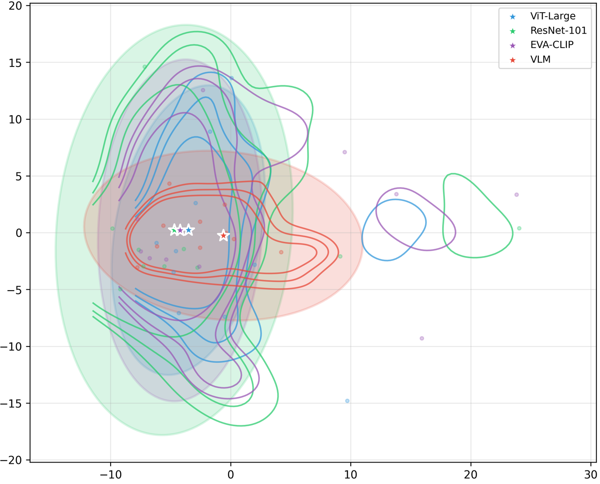
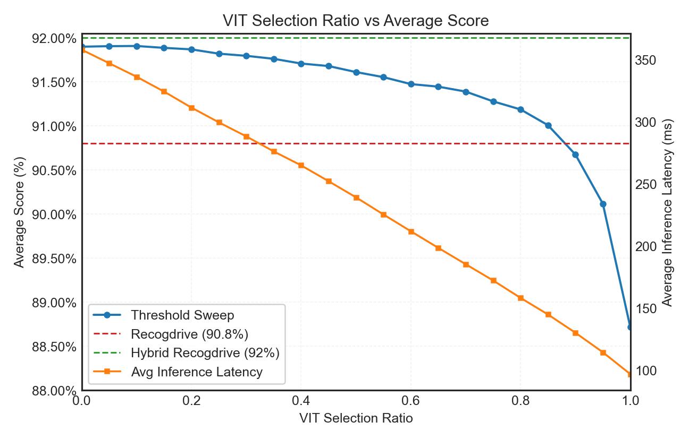

## Overview

**Org**: (Affiliation not disclosed in arXiv preprint)  
**Venue**: Machine Learning, ICML  
**arXiv**: 2602.10719v1

This paper asks: given a full VLM (InternVL-2B) and vision-only backbones (ViT/ResNet/EVA-CLIP) plugged into the same RecogDrive diffusion-Transformer planner architecture — what is actually different, and can that difference be exploited? The answer is a 3-RQ analysis leading to two practical systems:

- **HybridDriveVLA**: run both branches, select from an 11-trajectory candidate set using a learned scorer → **92.10 PDMS** (NAVSIM-v1)
- **DualDriveVLA**: fast–slow deployment; ViT by default, VLM invoked only on low-confidence cases (15%) → **91.00 PDMS** at **3.2× throughput**

---

## System Overview

*Figure 3: Dual-branch RecogDrive setup. VLM branch (InternVL-2B) and vision-only branch (ViT/ResNet/EVA-CLIP) produce separate trajectories via the same DiT planner. Features are probed at backbone level (after adapter) and decision level (DiT output before action head). Candidates are interpolated and scored to produce the final trajectory.*

Both branches share identical planner/action architecture and training schedule. The only difference is the backbone initialization and which backbone parameters are updated during training.

---

## RQ1: Representation Analysis

### CKA Similarity

Linear CKA (scale-invariant pairwise geometry measure) is computed at two points in the stack:

*Figure 2: CKA similarity matrices. Left: backbone-level features — vision-only encoders cluster tightly together but VLM is low-similarity (~0.22). Right: DiT-level features — all branches converge markedly (~0.54 VLM–ViT similarity), indicating the planner compresses heterogeneous visual signals into a shared decision space.*

| Level | VLM–ViT CKA |
|-------|------------|
| Backbone | ~0.22 |
| DiT (policy output) | ~0.54 |

The expansion of the CCA-aligned subspace (from 5/28 to 28/78 dimensions with ρ>0.8) and increased aligned energy fraction (28%→53% for VLM, 56%→77% for ViT) corroborate the same conclusion.

### Procrustes + PCA Visualization

*Figure 1: After Procrustes alignment to a shared reference (ResNet-101), KDE contours show vision-only backbones form a tight cluster, while the VLM shares a large core with them but also occupies additional unique subspace. Neither strict containment nor strict disjointness — a mixture.*

### Shared–Unique SAE

An additive Shared–Unique Sparse Autoencoder decomposes each branch's features into shared and unique latents. Key metric: cross-reconstruction R² (using branch X's shared code to reconstruct branch Y's features).

| Feature Level | CKA_orig | R²_cross (x←z_s^y) | R²_cross (y←z_s^x) | Δ_cross(x) | Δ_cross(y) | CCA mean@10 | CCA AER |
|---|---|---|---|---|---|---|---|
| Backbone | 0.213 | 0.537 | 0.623 | 0.098 | 0.160 | 0.800 | 0.286/0.556 |
| DiT | 0.537 | 0.546 | 0.763 | 0.071 | 0.063 | 0.972 | 0.534/0.771 |

Smaller Δ_cross at DiT level = more interchangeable shared factors = policy learning makes the two branches more similar at the decision level.

### Negative Result: Representation-Only Gating Fails

Using backbone/DiT features + SAE statistics to predict *which branch wins per scenario* (rule-based, Random Forest, GBDT, MLP, attention gate):

| Method | PDMS |
|--------|------|
| RecogDrive-VLM (baseline) | 90.80 |
| RecogDrive-ViT-large | 88.88 |
| Oracle best-of-2 | **93.58** |
| Best rule (smoothed shared-dominance) | 90.29 |
| Best learned gate (self-attention score regression) | 90.96 |

**Conclusion**: representation-only gating yields only marginal gains over the VLM baseline (~+0.16 max) and remains far below the oracle (+2.78). This motivates trajectory-level signals.

---

## RQ2: Behavioral Complementarity

### Long-Tail Complementarity

With threshold τ = 0.2 (|ΔPDMS| > 20%):
- VLM decisively outperforms ViT: **257 scenarios**
- ViT decisively outperforms VLM: **253 scenarios**

With τ = 0.5:
- VLM wins: **159** | ViT wins: **153**

The near-symmetric long tails confirm "real but long-tailed" complementarity — neither policy strictly contains the other.

### Style Differences

**Longitudinal**: VLM is faster in ~66% of scenarios; ViT is more conservative. VLM collisions tend to be rear-end (speed-related). Expert trajectory often lies *between* the two.

**Lateral**: VLM and ViT show systematic lane-centering, merge-timing, and path-choice differences. Again, expert behavior often takes the intermediate path.

### Set-Level Evidence

Best-of-2 oracle (pick the better trajectory per scenario):
- Single VLM: 90.80 PDMS
- Oracle best-of-2 (VLM + ViT): **93.58 PDMS** (+2.78)
- Oracle best-of-6: **94.00 PDMS**

This confirms exploitable diversity. Crucially, within-model BoN diversity is very limited:

| Candidate Set | BoN-1 | BoN-3 | BoN-6 |
|---|---|---|---|
| ViT samples only | 88.88 | 89.13 | 89.32 |
| VLM samples only | 90.80 | 91.57 | 91.95 |
| Cross-model oracle | — | — | **93.58** |

Cross-model diversity >> within-model sampling diversity. This shifts the focus from "sample more" to "sample complementarily."

---

## RQ3: From Complementarity to Systems

### HybridDriveVLA

**Candidate construction**: interpolate between the two endpoint trajectories along the VLM–ViT style axis:
$$\tau_\alpha = \alpha \cdot \tau_\text{ViT} + (1-\alpha) \cdot \tau_\text{VLM}, \quad \alpha \in \{0.1, \ldots, 0.9\}$$

11-candidate set: {τ_ViT, τ_VLM, τ_0.1, …, τ_0.9}. Expert behavior often lies between the two endpoints — these interpolations target the most likely region.

**Trajectory scorer**: DrivoR-style; predicts PDMS sub-score components from decoded waypoints + perceptual scene tokens. Score queries are explicitly re-embedded (MLP) from finalized trajectories, not from generator latents — separating generation from scoring. Trained with component-wise BCE/regression supervision:
$$\mathcal{L}_\text{score} = \sum_c \lambda_c \cdot \mathbb{E}[\ell_c(\hat{\mathcal{G}}_c(\tau, i), \mathcal{G}_c(\tau, i))]$$

Final selection:
$$\tau^* = \arg\max_{\tau \in \mathcal{C}} \hat{s}(\tau)$$

**Ablation**:

| Method | PDMS |
|--------|------|
| ViT single | 88.88 |
| VLM single | 90.80 |
| Trajectory mean (endpoints) | 91.18 |
| Rule-based selection (grid search) | 91.21 |
| Adaptive weighting (predict α) | 91.31 |
| Scorer selection (endpoints only) | 91.75 |
| **HybridDriveVLA (endpoints + interpolations + scorer)** | **92.10** |

### DualDriveVLA: Fast–Slow Deployment

Run ViT by default → score with trajectory scorer → if $\hat{s}(\tau_\text{ViT}) \geq \gamma$, output immediately; otherwise invoke VLM + full 11-candidate selection.

*Figure 4: DualDriveVLA accuracy–compute tradeoff as a function of the confidence threshold γ (= fraction of scenarios routed to the fast ViT-only path). At 85% fast-path acceptance (15% VLM invocations): 91.00 PDMS at 3.2× throughput.*

Key operating points:
- 100% ViT: 88.88 PDMS
- 15% VLM invocations: 91.00 PDMS, 3.2× throughput
- 100% HybridDriveVLA: 92.10 PDMS (both branches always run)

---

## NAVSIM-v1 Comparison (PDMS)

| Method | NC↑ | DAC↑ | TTC↑ | Comf.↑ | EP↑ | PDMS↑ |
|--------|-----|------|------|--------|-----|-------|
| DiffusionDrive | 98.2 | 96.2 | 94.7 | 100 | 82.2 | 88.1 |
| AutoVLA | 98.4 | 95.6 | 98.0 | 99.9 | 81.9 | 89.1 |
| DriveVLA-W0 | 98.7 | 99.1 | 95.3 | 99.3 | 83.3 | 90.2 |
| ReCogDrive | 97.9 | 97.3 | 94.9 | 100 | 87.3 | 90.8 |
| WAM-diff | 99.1 | 98.3 | 96.5 | 99.9 | 84.4 | 91.0 |
| DiffusionDriveV2 | 98.3 | 97.9 | 94.8 | 99.9 | 88.0 | 91.2 |
| iPad | 98.6 | 98.3 | 94.9 | 100 | 88.0 | 91.7 |
| **HybridDriveVLA** | **98.6** | **98.6** | **96.2** | **100** | **87.3** | **92.1** |

## NAVSIM-v2 Comparison (EPDMS)

| Method | NC↑ | DAC↑ | EP↑ | TTC↑ | C↑ | TL↑ | DDC↑ | LK↑ | EC↑ | EPDMS↑ |
|--------|-----|------|-----|------|----|-----|------|-----|-----|--------|
| ReCogDrive | 98.3 | 95.2 | 87.1 | 97.5 | 98.3 | 99.8 | 99.5 | 96.6 | 86.5 | 83.6 |
| DiffusionDriveV2 | 97.7 | 96.6 | 88.9 | 97.2 | 97.8 | 99.8 | 99.2 | 96.0 | 91.0 | 85.5 |
| **HybridDriveVLA** | **98.6** | **92.2** | **89.7** | **98.5** | **98.3** | **99.8** | **99.3** | **96.6** | **87.0** | **85.5** |

**Notable weakness**: DAC = 92.2 on NAVSIM-v2 (vs. 96.6 for DiffusionDriveV2) — interpolated trajectories occasionally violate drivable area constraints. EPDMS ties DiffusionDriveV2 at 85.5 despite the DAC penalty, driven by higher TTC and EP.

---

## Key Findings Summary

1. **Policy learning compresses heterogeneous backbone signals**: backbone CKA 0.22 → DiT CKA 0.54; policy learns a shared decision representation regardless of visual encoder
2. **Representation-only gating is insufficient**: the information needed to predict scenario-level winners is not cleanly encoded in static representations
3. **Complementarity is real but long-tailed**: each policy wins decisively on ~2–3% of scenarios; neither is a subset of the other
4. **Cross-model diversity >> within-model sampling**: BoN-6 ViT = 89.32; oracle cross-model best-of-2 = 93.58
5. **Linear interpolation targets the expert**: the ground-truth expert trajectory often lies between VLM and ViT endpoints on both speed and path axes
6. **Scorer + interpolation is the practical combination**: endpoints-only scorer reaches 91.75; adding interpolations to 92.10 (+0.35)

---

## Limitations

1. **HybridDriveVLA doubles inference cost** — both branches must run; DualDriveVLA mitigates this only partially (15% VLM invocations)
2. **Scorer requires oracle sub-score supervision** during training — the scorer is learned from PDMS sub-components, not zero-shot
3. **NAVSIM is non-reactive** — behavioral diversity findings may not fully translate to interactive scenarios where other agents respond to ego
4. **Linear interpolation may produce kinematically infeasible waypoints** in edge cases (reflected in DAC drop on NAVSIM-v2)
5. **Analysis is on a single architecture** (RecogDrive) — whether complementarity generalizes to other VLA stacks is untested
6. **Global confidence threshold γ** in DualDriveVLA is not adaptive per scenario type — misrouting hard scenarios remains possible
