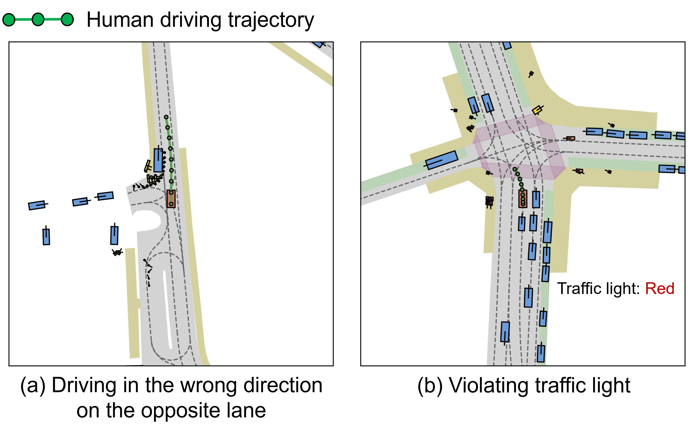
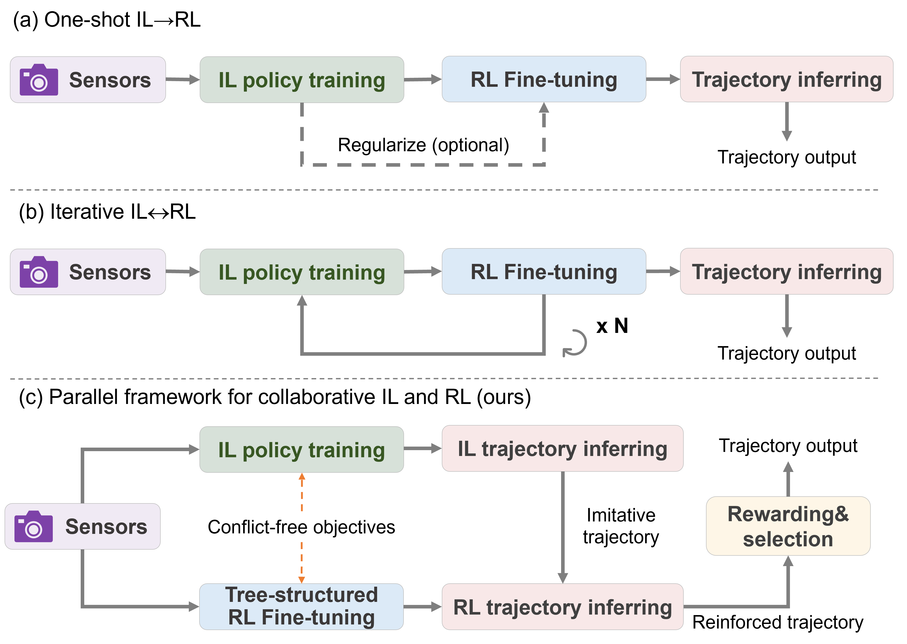
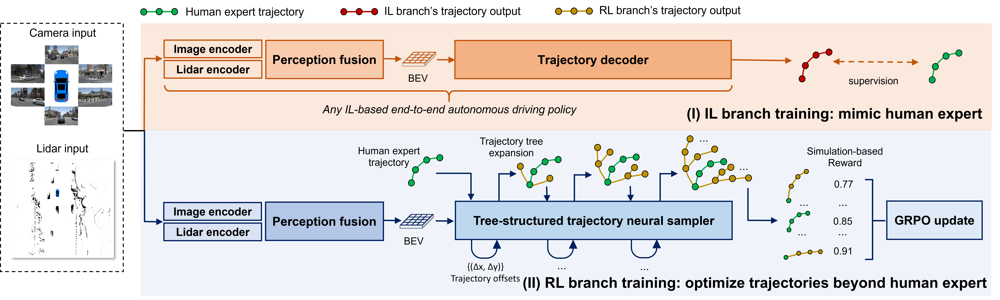
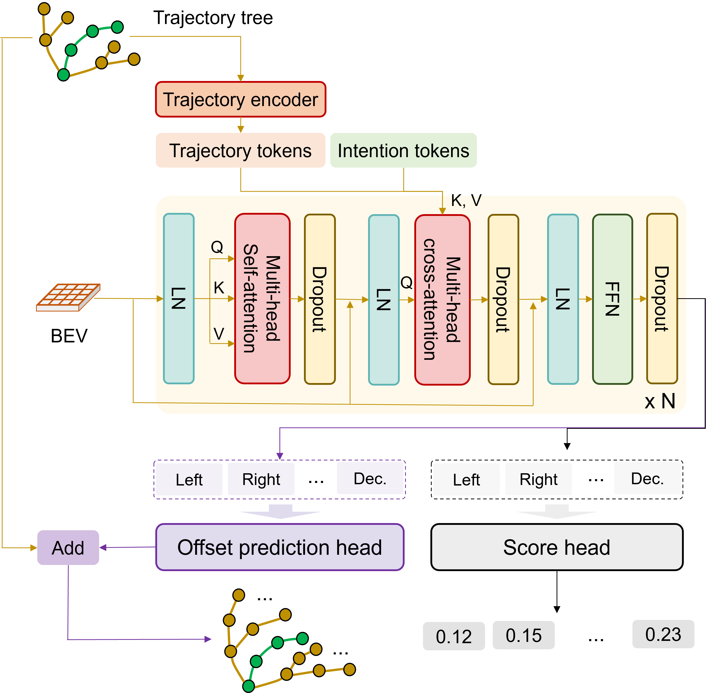
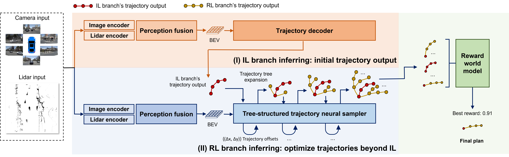
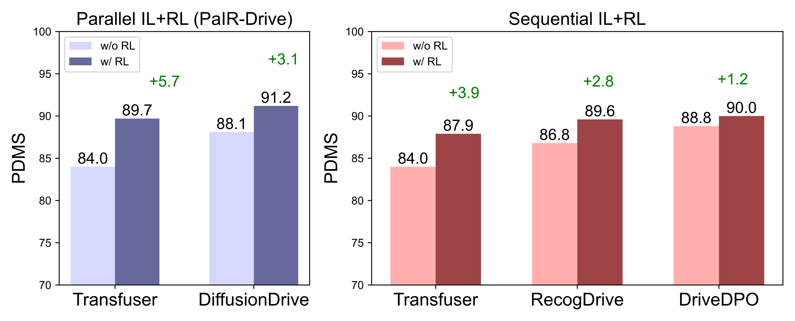
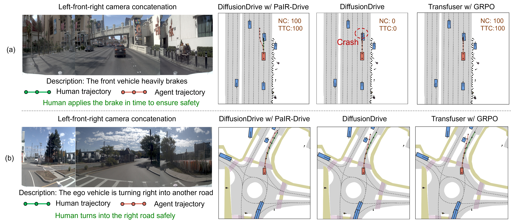

# PaIR-Drive

PaIR-Drive challenges the usual imitation-learning-then-reinforcement-learning pipeline. Instead of fine-tuning the same policy with conflicting IL and RL objectives, it trains two independent branches: an IL planner learns the human trajectory, while an RL trajectory sampler learns reward-improving residuals around human trajectories. At inference, the trained RL sampler is centered on an arbitrary IL planner's proposal, and a reward world model (RWM) selects the final candidate.

The intended benefit is modularity. The RL branch is trained once against human references rather than a particular IL network, then reused with TransFuser and DiffusionDrive without RL retraining. Its central mechanism is a recurrent, intention-conditioned trajectory tree optimized with GRPO.

## Key Takeaways

- **Separate networks avoid direct IL/RL gradient conflict.** IL and RL have independent objectives and can be trained concurrently or independently.
- **The RL branch is a residual proposal generator.** It predicts waypoint offsets around a reference trajectory rather than replacing the base planner.
- **Exploration is structured by intentions.** Left, right, acceleration, deceleration, and related learned intention tokens expand a temporal trajectory tree.
- **Training and inference use different references.** The RL branch expands around human trajectories during training and around IL predictions at inference.
- **Selection is integral to deployment.** A learned RWM ranks the candidate tree; the reported dagger results additionally use Best-of-6.
- **Single-plan gains are substantial but below peak selected results.** DiffusionDrive rises from 88.1 to 91.2 PDMS and from 84.3 to 87.9 EPDMS; Best-of-6 reaches 94.0/89.6.
- **Tree structure is the strongest ablated component.** With a TransFuser base and Best-of-6, tree residual prediction reaches 93.3 PDMS / 88.5 EPDMS versus 88.8/81.6 for unstructured residual prediction.
- **Larger GRPO groups help in this sampler.** Increasing group size from 5 to 15 raises 89.1 to 93.3 PDMS and 80.6 to 88.5 EPDMS.

## Motivation and Training Schemes

The paper contrasts three arrangements:

1. **One-shot IL → RL:** RL updates the pretrained IL parameters and risks policy drift or an IL-limited local optimum.
2. **Iterative IL ↔ RL:** alternating updates anchor the policy but still place inconsistent objectives on one network.
3. **Parallel IL + RL:** IL learns the expert trajectory while a separate RL network learns reward-improving proposals around that reference.

## Architecture

### IL Branch

The demonstrated implementation uses ResNet-34 camera and LiDAR encoders, BEV fusion, and the TransFuser trajectory decoder. It minimizes L1 error to the human trajectory. The authors state that this branch can be replaced by another IL planner.

### RL Branch

The RL branch consumes camera/LiDAR-derived BEV features plus a reference trajectory. At each temporal expansion it predicts intention-specific offsets $(\Delta x,\Delta y,\Delta h)$ and their log probabilities. Expansion occurs every two steps, and higher-value partial candidates are retained to control combinatorial growth.

GRPO uses the simulator reward for a candidate group:

$$
A_i=\frac{r_i-\operatorname{mean}(\{r_j\})}{\operatorname{std}(\{r_j\})},
$$

with clipped likelihood ratios, a previous-policy reference, and dynamic KL regularization. The reward combines NAVSIM safety, compliance, efficiency, and comfort metrics.

### Inference and RWM Selection

At inference, the human reference is replaced by the IL branch's proposal. The trained RL branch expands a candidate tree around it. The RWM predicts a reward and confidence for every candidate conditioned on BEV features and the driving command, then selects the final plan.

## Human-Behavior Correction

### Table 1: NAVSIM-v1 Human Reference Refinement

| Split | Agent | NC | DAC | EP | TTC | Comfort | PDMS |
| --- | --- | ---: | ---: | ---: | ---: | ---: | ---: |
| Human bad v1 | Human | 100.0 | 100.0 | 60.1 | 99.6 | 94.8 | 82.3 |
| Human bad v1 | Human + PaIR-Drive | 100.0 | 100.0 | 62.5 | 99.9 | 97.5 | **83.9 (+1.6)** |
| Navtest | Human | 100.0 | 100.0 | 87.4 | 100.0 | 99.6 | 94.7 |
| Navtest | Human + PaIR-Drive | 100.0 | 100.0 | 89.6 | 100.0 | 99.5 | **95.5 (+0.8)** |

`Human bad v1` contains navtest scenes whose human PDMS is below 85.

### Table 2: NAVSIM-v2 Human Reference Refinement

| Split | Agent | NC | DAC | DDC | TLC | EP | TTC | LK | HC | EC | EPDMS |
| --- | --- | ---: | ---: | ---: | ---: | ---: | ---: | ---: | ---: | ---: | ---: |
| Human bad v2 | Human | 100.0 | 100.0 | 97.0 | 70.4 | 83.2 | 99.6 | 46.2 | 82.7 | 56.6 | 50.0 |
| Human bad v2 | Human + PaIR-Drive | 100.0 | 100.0 | 98.3 | 77.5 | 84.2 | 99.4 | 66.5 | 82.4 | 49.3 | **60.8 (+10.8)** |
| Navtest | Human | 100.0 | 100.0 | 99.7 | 97.4 | 87.4 | 100.0 | 87.4 | 98.1 | 90.1 | 90.3 |
| Navtest | Human + PaIR-Drive | 100.0 | 100.0 | 99.9 | 98.0 | 89.6 | 100.0 | 91.7 | 98.1 | 86.4 | **91.9 (+1.6)** |

`Human bad v2` contains navtest scenes whose human EPDMS is below 80. PaIR-Drive improves aggregate score but lowers EC from 56.6 to 49.3 on the hard split and from 90.1 to 86.4 on navtest, showing a metric tradeoff hidden by the composite gain.

## Main Results

### Table 3: NAVSIM-v1

`†` denotes Best-of-6.

| Type | Agent | NC | DAC | EP | TTC | Comfort | PDMS |
| --- | --- | ---: | ---: | ---: | ---: | ---: | ---: |
| IL | AutoVLA without GRPO | 96.9 | 92.4 | 75.8 | 88.1 | 99.9 | 80.5 |
| IL | VADv2 | 97.2 | 89.1 | 76.0 | 91.6 | 100.0 | 80.9 |
| IL | TransFuser without RL | 97.7 | 92.8 | 79.2 | 92.8 | 100.0 | 84.0 |
| IL | ReCogDrive without RL | 98.3 | 95.1 | 81.1 | 94.3 | 100.0 | 86.8 |
| IL | ARTEMIS | 98.3 | 95.1 | 81.4 | 94.3 | 100.0 | 87.0 |
| IL | DiffusionDrive | 98.2 | 96.2 | 82.2 | 94.7 | 100.0 | 88.1 |
| IL | WoTE | 98.5 | 96.8 | 81.9 | 94.9 | 99.9 | 88.3 |
| IL | DriveDPO without RL | 97.9 | 97.3 | 84.0 | 93.6 | 100.0 | 88.8 |
| Sequential | TransFuser + GRPO | 98.0 | 94.7 | 88.5 | 96.6 | 100.0 | 87.9 (+3.9) |
| Sequential | ReCogDrive + GRPO | 98.2 | 97.8 | 83.5 | 95.2 | 99.8 | 89.6 (+2.8) |
| Sequential | DriveDPO + DPO | 98.5 | 98.1 | 84.3 | 94.8 | 99.9 | 90.0 (+1.2) |
| Sequential | AutoVLA + GRPO† | 99.1 | 97.1 | 87.6 | 97.1 | 100.0 | 92.1 (+11.6) |
| Parallel | TransFuser + PaIR-Drive | 99.1 | 96.1 | 88.1 | 98.2 | 93.1 | 89.7 (+5.7) |
| Parallel | TransFuser + PaIR-Drive† | 99.5 | 99.2 | 88.0 | 99.2 | 98.1 | **93.3 (+9.3)** |
| Parallel | DiffusionDrive + PaIR-Drive | 99.1 | 97.6 | 88.3 | 98.5 | 94.1 | 91.2 (+3.1) |
| Parallel | DiffusionDrive + PaIR-Drive† | **99.6** | **99.5** | 88.1 | **99.5** | 98.6 | **94.0 (+5.9)** |

The strongest progress score in PaIR-Drive's rows is the single-plan DiffusionDrive variant (88.3), while Best-of-6 mainly raises safety/compliance. Comfort drops versus both base IL planners in the non-dagger rows.

### Table 4: NAVSIM-v2

| Type | Agent | NC | DAC | DDC | TLC | EP | TTC | LK | HC | EC | EPDMS |
| --- | --- | ---: | ---: | ---: | ---: | ---: | ---: | ---: | ---: | ---: | ---: |
| IL | VADv2 | 97.3 | 91.7 | 98.2 | 99.9 | 77.6 | 92.7 | 98.2 | 100.0 | 97.4 | 76.6 |
| IL | TransFuser without RL | 97.2 | 91.8 | 99.2 | 99.8 | 87.6 | 95.7 | 95.7 | 98.4 | 87.7 | 79.7 |
| IL | ARTEMIS | 98.3 | 95.1 | 98.6 | 99.8 | 81.5 | 97.4 | 96.5 | 100.0 | 98.3 | 83.1 |
| IL | WoTE | 98.5 | 96.8 | 98.8 | 99.8 | 86.1 | 97.9 | 95.5 | 98.3 | 82.9 | 84.2 |
| IL | DiffusionDrive | 98.0 | 96.0 | 99.5 | 99.8 | 87.7 | 97.1 | 97.2 | 98.3 | 87.6 | 84.3 |
| Sequential | ReCogDrive + GRPO | 98.3 | 95.2 | 99.5 | 99.8 | 87.1 | 97.5 | 96.6 | 98.3 | 86.5 | 83.6 |
| Sequential | TransFuser + GRPO | 98.0 | 94.7 | 99.3 | 99.8 | 88.5 | 96.6 | 96.4 | 98.3 | 89.3 | 83.8 (+4.1) |
| Parallel | TransFuser + PaIR-Drive | 99.1 | 96.1 | 99.4 | 100.0 | 88.1 | 98.2 | 96.2 | 94.3 | 74.2 | 86.6 (+6.9) |
| Parallel | TransFuser + PaIR-Drive† | 99.5 | 99.0 | 99.6 | 100.0 | 87.8 | 99.2 | 97.6 | 97.2 | 72.0 | 88.5 (+8.8) |
| Parallel | DiffusionDrive + PaIR-Drive | 99.1 | 97.6 | 99.5 | 100.0 | 88.3 | 98.5 | 96.9 | 94.8 | 74.0 | 87.9 (+3.6) |
| Parallel | DiffusionDrive + PaIR-Drive† | **99.6** | **99.5** | **99.7** | **100.0** | 88.1 | **99.5** | **98.3** | 97.7 | 76.4 | **89.6 (+5.3)** |

PaIR-Drive's EPDMS gains coincide with substantially worse Extended Comfort than the base planners. For DiffusionDrive, EC falls from 87.6 to 74.0 without Best-of-6 and 76.4 with it. This is a material tradeoff, not merely table noise.

## Ablations

### Table 5: Tree Sampling and GRPO Group Size

All results use TransFuser and Best-of-6.

| Structure | Prediction | PDMS | EPDMS |
| --- | --- | ---: | ---: |
| No tree | Offset | 88.8 | 81.6 |
| No tree | Full trajectory | 87.9 | 83.8 |
| Tree | Offset | **93.3** | **88.5** |

| GRPO group size | PDMS | EPDMS |
| ---: | ---: | ---: |
| 5 | 89.1 | 80.6 |
| 9 | 89.3 | 81.4 |
| 12 | **93.3** | 86.9 |
| 15 | **93.3** | **88.5** |

### Table 6: RWM Dependence

The pretrained IL policy is DiffusionDrive.

| Agent | PDMS | EPDMS |
| --- | ---: | ---: |
| Vanilla IL | 88.1 | 84.3 |
| IL + RWM | 90.2 | 87.0 |
| PaIR-Drive + RWM | **94.0** | **89.6** |

The table shows that candidate generation adds value beyond applying the selector to IL output, but it does not isolate PaIR-Drive without the RWM because RWM selection is part of its inference path.

## Training Details

- Inputs: `1024×256` RGB and `256×256` LiDAR point-cloud features.
- Backbone: ResNet-34.
- IL: 50 epochs, four NVIDIA L40 GPUs, batch size 32 per GPU, AdamW, learning rate `1e-4`.
- RL: 50 epochs, four NVIDIA L40 GPUs, batch size 16 per GPU, AdamW, initial learning rate `2e-5`, cosine decay.
- GRPO: group size 15, clipping range 0.2, dynamic KL weight.
- Evaluation: official NAVSIM navtest plus `human bad v1` and `human bad v2` subsets.

## Limitations

- **Reference distribution shift.** RL is trained around ground-truth human trajectories but deployed around imperfect IL predictions; the paper does not quantify robustness as reference error grows.
- **RWM is under-specified.** Architecture, targets, dataset construction, loss, calibration, confidence use, and selection rule are not described beyond one equation.
- **Selection confounds peak results.** The strongest main and all tree/group ablations use Best-of-6, so candidate-generation quality and inference-time selection are not cleanly separated.
- **Inference cost is missing.** No latency, memory, candidate count after pruning, RWM cost, or real-time throughput is reported.
- **Plug-and-play scope is narrow.** Reuse is shown for TransFuser and DiffusionDrive, both camera–LiDAR planners evaluated in the same NAVSIM setup; transfer to VLM, camera-only, or structurally different policies is untested.
- **NAVSIM only.** There is no reactive closed-loop simulator, nuPlan/Bench2Drive evaluation, real-vehicle test, or cross-domain validation.
- **No uncertainty reporting.** Tables contain point estimates without seeds, variance, or confidence intervals.
- **Comfort tradeoff.** Single-plan PDMS and EPDMS gains accompany substantial Comfort/Extended Comfort degradation, especially on NAVSIM-v2.
- **Human correction is benchmark-relative.** The method improves simulator scores around recorded human trajectories; this does not establish that it is behaviorally superior to humans outside the evaluator's reward definition.
- **Parallel does not mean joint collaboration.** The branches are decoupled during training; their collaboration occurs through reference-conditioned proposal refinement at inference, not shared representation learning or mutual online updates.

## Wiki Relevance

- [[concepts/parallel-il-rl.md]] — canonical example of separating IL and RL parameter spaces and composing them through residual proposals.
- [[concepts/rl-for-ad.md]] — contrasts policy fine-tuning with a reusable RL proposal module.
- [[concepts/gspo-vs-grpo.md]] — tree-structured group construction increases diversity before standard GRPO normalization.
- [[concepts/best-of-n.md]] — separates PaIR-Drive's single-plan gains from Best-of-6 peaks.
- [[concepts/selection-based-planning.md]] — the RWM turns proposal generation into a learned selection pipeline.
- [[concepts/navsim-benchmark.md]] — adds explicit human-bad subsets and shows aggregate EPDMS can hide Extended Comfort regressions.
