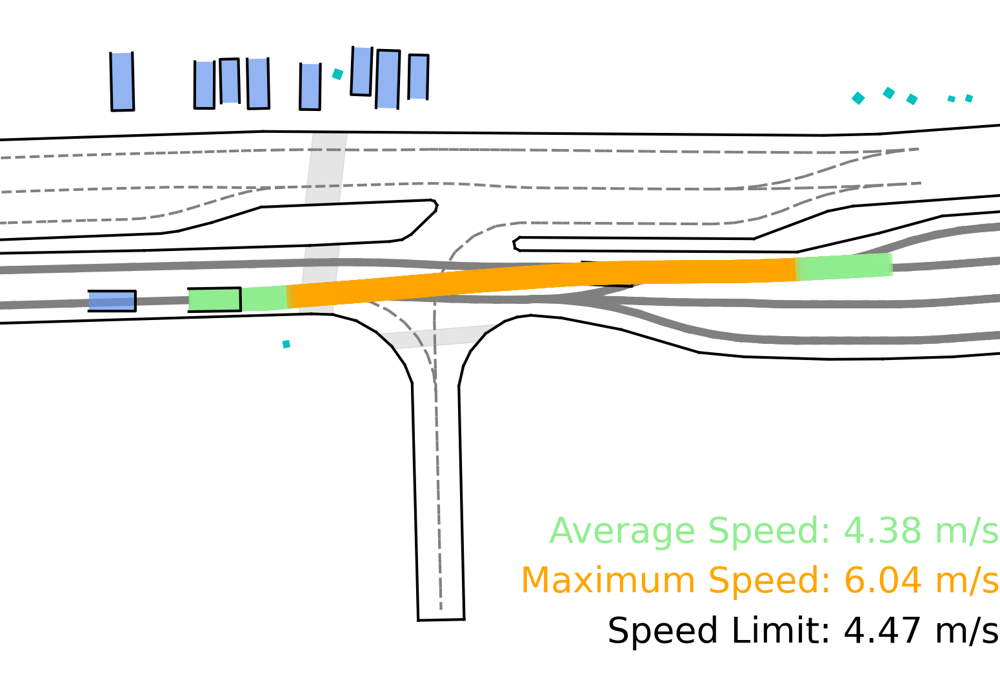
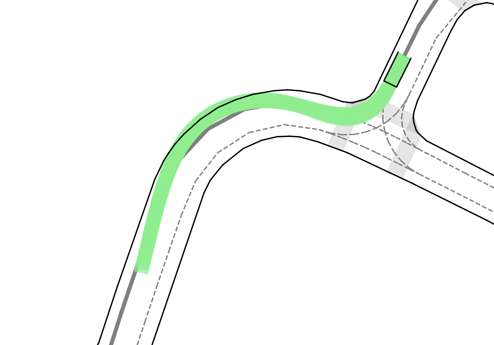

# Plan-R1

Plan-R1 frames trajectory planning like language modeling: pretrain an autoregressive motion-token predictor on expert driving, then fine-tune the ego policy with rule-based rewards for safety, comfort, speed compliance, and progress. The paper's main technical contribution is **Variance-Decoupled GRPO (VD-GRPO)**, a GRPO variant that removes per-group reward standard-deviation normalization so rare unsafe groups are not downweighted.

The system is not a VLM. It is a compact tokenized trajectory planner evaluated on nuPlan, but it is highly relevant to the wiki's GRPO/R1 thread because it gives a concrete autonomous-driving failure mode for standard group-normalized advantages.

## Key Takeaways

- **Two-stage training**: expert-data pretraining learns human-like multi-agent motion; RL fine-tuning aligns the ego planner to explicit principles.
- **Trajectory-as-language formulation**: continuous trajectories become discrete motion tokens, and future motion is generated autoregressively with next-token prediction.
- **Dual-model rollout**: a trainable ego planner interacts with a frozen pretrained agent predictor used as a reactive world model for surrounding agents.
- **Safety-gated reward**: collision/drivable-area indicators multiplicatively gate a weighted soft reward for TTC, comfort, speed compliance, and progress.
- **VD-GRPO**: replaces standard GRPO reward normalization `(R - mean) / std` with `(R - mean) / c`, preserving cross-group reward scale.
- **Main result**: Plan-R1 reports the strongest learning-based reactive nuPlan scores among listed baselines: Val14 R 87.69, Test14-hard R 77.20, Test14-random R 90.04.

## Figures

## Method

### Motion Tokens

Plan-R1 discretizes continuous trajectories into motion tokens. Trajectories are segmented temporally, then K-disk clustering is applied over motion segments using average corner distance. Appendix D specifies:

- vocabulary size: 1024 tokens per agent category;
- categories: Vehicle, Pedestrian, Cyclist;
- each token: 0.5-second movement segment;
- ego uses the Vehicle vocabulary;
- model: 6-layer transformer decoder, 8 heads, hidden size 128;
- parameters: about 5.05M per autoregressive predictor, about 10.1M for the dual-model setup.

### Pretraining

The pretrained predictor learns next-motion-token prediction for all agents using teacher forcing and cross-entropy. Training uses 32 epochs, batch size 64, AdamW, learning rate `3e-4`, weight decay `1e-4`, dropout 0.1, and cosine decay.

### RL Fine-Tuning

The ego policy is fine-tuned while a frozen pretrained copy predicts surrounding-agent responses. This avoids logged-agent replay during RL, which would ignore the ego planner's interventions and produce non-reactive rollouts.

Fine-tuning uses GRPO-style grouped rollouts with group size `G=4`, KL weight `beta=0.1`, learning rate `4e-6`, 5 epochs, dropout 0.1, and no data augmentation. Inference selects the top-1 token at each step.

### Reward Design

The reward is:

$$
R(y_t)=\prod_{k\in I_\text{safe}} 1_{k,t}\cdot\sum_{j\in I_\text{cost}} w_j r_j(y_t)
$$

Safety indicators:

- drivable-area compliance;
- no collision with dynamic agents;
- no collision with static obstacles.

Soft terms:

- comfort, weight 2;
- time-to-collision, weight 5;
- speed-limit compliance, weight 2;
- progress, weight 1.

Speed and progress are trajectory-level metrics, so the paper normalizes them to `[0,1]` and assigns the same value to every token for token-level GRPO.

## VD-GRPO

Standard GRPO computes:

$$
\tilde{R}^{GRPO}(y_t^g)=\frac{R(y_t^g)-\mu_R}{\sigma_R}
$$

The paper argues this is wrong for safety-critical multi-objective planning. Unsafe groups tend to have higher reward variance because safety indicators can zero out reward, while safe groups mostly vary through small soft-cost differences. Dividing by group standard deviation therefore applies an implicit group weight `1 / sigma_R`, downweighting exactly the unsafe groups that should dominate the update.

VD-GRPO uses:

$$
\tilde{R}^{VD}(y_t^g)=\frac{R(y_t^g)-\mu_R}{c}
$$

The fixed scale `c` preserves cross-group reward magnitude and restores the RL/KL balance that GRPO's variance normalization implicitly provided. The paper fixes `c=1e-1`.

## Results

### Table 1: nuPlan Benchmark

NR = non-reactive; R = reactive; `*` uses rule-based post-processing.

| Type | Planner | Val14 NR | Val14 R | Test14-hard NR | Test14-hard R | Test14-random NR | Test14-random R |
| --- | --- | ---: | ---: | ---: | ---: | ---: | ---: |
| Expert | Log-Replay | 93.53 | 80.32 | 85.96 | 68.80 | 94.03 | 75.86 |
| Rule/Hybrid | IDM | 75.60 | 77.33 | 56.15 | 62.26 | 70.39 | 72.42 |
| Rule/Hybrid | PDM-Closed* | 92.84 | 92.12 | 65.08 | 75.19 | 90.05 | 91.64 |
| Rule/Hybrid | PDM-Hybrid* | 92.77 | 92.11 | 65.99 | 76.07 | 90.10 | 91.28 |
| Rule/Hybrid | Gameformer* | 79.94 | 79.78 | 68.70 | 67.05 | 83.88 | 82.05 |
| Rule/Hybrid | PLUTO* | 92.88 | 89.84 | 80.08 | 76.88 | 92.23 | 90.29 |
| Rule/Hybrid | PlanAgent* | 93.26 | 92.75 | 72.51 | 76.82 | - | - |
| Rule/Hybrid | Diffusion Planner* | 94.26 | 92.90 | 78.87 | 82.00 | 94.80 | 91.75 |
| Rule/Hybrid | CarPlanner* | - | - | - | - | 94.07 | 91.10 |
| Rule/Hybrid | Plan-R1* | 94.72 | 93.54 | 78.46 | 81.70 | 94.64 | 93.71 |
| Learning | UrbanDriver | 68.57 | 64.11 | 50.40 | 49.95 | 51.83 | 67.15 |
| Learning | PDM-Open | 53.53 | 54.24 | 33.51 | 35.83 | 52.81 | 57.23 |
| Learning | PlanTF | 84.27 | 76.95 | 69.70 | 61.61 | 85.62 | 79.58 |
| Learning | PLUTO | 88.89 | 78.11 | 70.03 | 59.74 | 89.90 | 78.62 |
| Learning | Diffusion Planner | 89.87 | 82.80 | 75.99 | 69.22 | 89.19 | 82.93 |
| Learning | Plan-R1 | 88.98 | 87.69 | 77.45 | 77.20 | 91.23 | 90.04 |

The non-postprocessed Plan-R1 row is the key learning-based comparison. The paper emphasizes reactive mode: Plan-R1 beats Diffusion Planner by +4.89 Val14 R, +7.98 Test14-hard R, and +7.11 Test14-random R.

### Table 2: RL and VD-GRPO Ablation

| Planner | NR-CLS | Collision | TTC | Drivable | Speed | Comfort | Progress | R-CLS |
| --- | ---: | ---: | ---: | ---: | ---: | ---: | ---: | ---: |
| Pre-training only | 85.61 | 94.83 | 90.04 | 94.64 | 96.57 | 99.62 | 91.64 | 82.81 |
| + GRPO | 88.65 | 93.87 | 91.57 | 96.93 | 99.65 | 99.62 | 94.11 | 88.35 |
| + VD-GRPO | 91.23 | 97.32 | 95.02 | 97.32 | 99.45 | 99.62 | 91.94 | 90.04 |
| Delta vs. pretraining | +5.62 | +2.49 | +4.98 | +2.64 | +2.88 | +0.00 | +0.30 | +7.23 |

Standard GRPO improves overall score but drops collision avoidance from 94.83 to 93.87. VD-GRPO recovers collision and improves R-CLS by +1.69 over GRPO.

### Table 5: Reward Component Ablation

| Reward setting | NR-CLS | Collision | TTC | Drivable | Speed | Comfort | Progress |
| --- | ---: | ---: | ---: | ---: | ---: | ---: | ---: |
| w/o Collision | 73.10 | 94.15 | 74.33 | 96.56 | 99.55 | 99.23 | 94.15 |
| w/o Drivable | 88.88 | 96.17 | 94.25 | 95.79 | 99.40 | 99.62 | 92.19 |
| w/o Speed | 90.04 | 94.83 | 92.29 | 98.47 | 92.29 | 99.62 | 98.02 |
| w/o Comfort | 90.83 | 96.93 | 93.87 | 97.32 | 99.47 | 99.23 | 93.16 |
| w/o Progress | 80.01 | 97.70 | 95.79 | 98.85 | 99.69 | 98.85 | 68.95 |
| Full rewards | 91.23 | 97.32 | 95.02 | 97.32 | 99.45 | 99.62 | 91.94 |

Removing collision is the largest failure: NR-CLS drops to 73.10. Removing progress also collapses efficiency, with Progress falling to 68.95 and NR-CLS to 80.01.

### Table 6: interPlan Robustness

| Type | Planner | interPlan |
| --- | --- | ---: |
| Expert | Log-Replay | 14.76 |
| Rule/Hybrid | IDM | 47.07 |
| Rule/Hybrid | PDM-Closed* | 69.64 |
| Rule/Hybrid | PLUTO* | 63.88 |
| Rule/Hybrid | Plan-R1* | 72.33 |
| Learning | UrbanDriver | 5.56 |
| Learning | PDM-Open | 26.22 |
| Learning | PlanTF | 47.72 |
| Learning | PLUTO | 57.74 |
| Learning | Diffusion Planner | 50.07 |
| Learning | Plan-R1 | 56.64 |

Without post-processing, Plan-R1 is slightly below PLUTO on interPlan (56.64 vs. 57.74). With the rule-based post-processing used in the comparison, Plan-R1* is highest at 72.33.

### Table 7: Frozen World Model Robustness

| Ego noise sigma (m) | ADE (m) | FDE (m) |
| ---: | ---: | ---: |
| 0 | 1.03 | 3.01 |
| 0.1 | 1.07 | 3.15 |
| 0.3 | 1.14 | 3.35 |
| 1.0 | 1.22 | 3.53 |
| 3.0 | 1.25 | 3.59 |
| 10.0 | 1.26 | 3.59 |

The paper interprets this as evidence that the frozen world model is not dominated by ego-state perturbations, because it also conditions on each agent's own history, interaction context, and map topology.

## Missing/Referenced Tables

The raw markdown references Table 3 (dual-model design) and Table 4 (group-size ablation), but those table bodies are not present in the source markdown. The surrounding text reports the main numbers: GT replay gives R-CLS 87.44, the full reactive world model gives R-CLS 90.04, and doubling the pretrained model gives only +2.13 compared with +7.23 from the dual-model setup. For group size, `G=4` is selected because it improves over `G=2`, while `G=6` gives no gain and raises GPU memory from 24GB to 36GB.

## Limitations

- **Simulation-only**: the ethics/reproducibility sections explicitly caution against real-world deployment without further validation.
- **Frozen world model fidelity**: the robustness test is encouraging but still internal to the learned predictor and nuPlan-like conditions; failures under richer interactive policies remain possible.
- **Reward design remains hand-built**: collision/drivable gates, TTC, comfort, speed, and progress are interpretable, but the priority structure is manually chosen.
- **Post-processing complicates SOTA claims**: Plan-R1* leads several postprocessed nuPlan columns, while non-postprocessed Plan-R1 is the cleaner learning-based comparison.
- **Raw markdown extraction gap**: the source file contains figures and most tables, but the table bodies for the cited Table 3 and Table 4 are absent.

## Wiki Relevance

- [[concepts/rl-for-ad.md]] - concrete example of GRPO failure under safety-critical multi-objective rewards.
- [[concepts/gspo-vs-grpo.md]] - VD-GRPO is another normalization correction, related to but distinct from Dr. GRPO and MUPO.
- [[concepts/action-tokenization.md]] - compact 1024-token motion vocabulary per agent category.
- [[concepts/inference-time-safety.md]] - training-time safety alignment, contrasting with inference-time repair/guidance methods.
- [[concepts/r1-zero-like-training.md]] - R1-style pretrain-then-RL analogy applied to trajectory planning rather than language reasoning.
