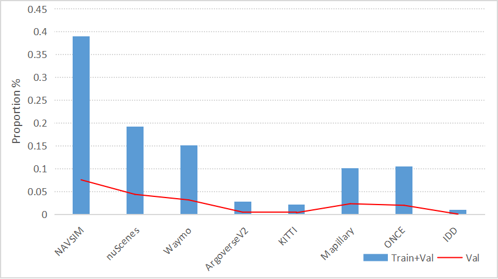

## Citation

Dapeng Zhang, Zhenlong Yuan, Zhangquan Chen, Chih-Ting Liao, Yinda Chen, Fei Shen, Qingguo Zhou, Tat-Seng Chua.  
Lanzhou University + NUS + USTC + Tsinghua + UNSW.  
arXiv: https://arxiv.org/html/2511.19912v1  
Code: https://github.com/xipi702/Reasoning-VLA

---

## Problem Statement

Existing VLA planners for autonomous driving face three issues:
1. **Speed**: AR and diffusion models require multiple inference steps — incompatible with real-time, high-frequency control
2. **Generalization**: models trained on a single dataset fail to generalize across vehicle platforms and driving environments
3. **Fine-tuning efficiency**: SFT alone leaves VLM reasoning potential unexploited; RL rewards rarely encode physical vehicle constraints

Reasoning-VLA addresses all three via: (1) parallel one-step action generation via learnable queries, (2) a unified 8-dataset corpus with CoT reasoning, (3) physics-aware GRPO rewards encoding steering and acceleration constraints.

---

## Architecture

*Figure 1: Reasoning-VLA pipeline. Top: VLM backbone → VL-to-A interaction (learnable action queries + cross-attention) → parallel action head → refinement → trajectory. Bottom: training process — SFT on structured CoT dataset, then GRPO RL with rule-based physics rewards.*

Three components:

### 1. VLM Reasoning Backbone — Qwen2.5-VL

The foundation model (3B or 7B) processes:
- Multi-view camera images (front + front-left + front-right)
- CoT reasoning prompt (structured `<think>...</think><answer>...</answer>` format)
- Ego vehicle status (past positions, velocity, acceleration at 0.5s intervals over 3s)

Qwen2.5-VL produces N hidden states that the action module attends to via cross-attention.

### 2. VL-to-Action Module (Learnable Action Queries)

*Figure 2: Action module. VLM hidden states cached as KV → cross-attention with learnable action queries → self-attention → action outputs. Queries initialized from GT trajectory Gaussian statistics.*

**Action query structure**: $AQ \in T \times N \times D$
- $T$: number of future timesteps
- $N$: coordinate dimensions (e.g., x, y = 2)
- $D$: feature dimensionality (matching Qwen2.5-VL's hidden dim)

**Initialization via Gaussian sampling from GT trajectories**:
1. Extract all trajectory values across training set: $D_{all} \times N \times T$ values
2. Compute per-position means: $\bar{x}_1, \bar{y}_1, \ldots, \bar{x}_N, \bar{y}_N$
3. For each position, sample $D$ values from $\mathcal{N}(\text{mean}, \text{var})$ → shape $N \times T \times D$
4. Use as initial action query parameters (learnable from this starting point)

**Forward pass**:
1. Self-attention among action queries
2. Cross-attention to VLM hidden state KV cache
3. All $T \times N$ trajectory predictions generated in **one parallel pass**
4. Replaces causal attention mask with bidirectional mask → all actions generated simultaneously

**Key advantage over AR**: generates all waypoints in one step rather than $N \times T$ sequential steps. No discretization of coordinates — continuous regression throughout.

### 3. Action Refinement Module (ARM)

MLP + attention applied to action query hidden states → final continuous action trajectories. Regression-based (not discretized). Smooths and refines the parallel decoder's initial predictions.

---

## Training: SFT + GRPO

### Stage 1: Supervised Fine-Tuning (SFT)

Train on unified dataset in structured CoT format. The `<think>` block contains multi-step physical reasoning about trajectory prediction; the `<answer>` block contains `<|place_holder|>` tokens that are replaced with the parallel action module's output.

Hyperparameters: LR 5e-5, batch 8, 4 epochs, bf16, Flash Attention 2, 8× H200 GPUs, DeepSpeed ZeRO-2.

### Stage 2: GRPO Reinforcement Learning

GRPO applied to the full model (VLM + action module jointly). LR 1e-6, batch 8, 1 epoch.

**Three physics-aware reward components**:

**Physical trajectory reward** (weighted Euclidean to GT, time-discounted):
$$r_{\text{traj}} = 1 - \frac{1}{N} \sum_{i=1}^{N} \gamma^i \left( \alpha(x^i - x^i_{\text{gt}})^2 + \beta(y^i - y^i_{\text{gt}})^2 \right)$$
$\alpha, \beta$ balance x/y scale differences; $\gamma^i$ discounts future uncertainty.

**Steering constraint reward** (step-wise binary):
$$r_{\text{steer}} = \frac{1}{N-1}\sum_{j=1}^{N-1} \mathbf{1}\!\left[\left|\frac{y^j - y^{j-1}}{x^j - x^{j-1}}\right| < 0.84\right]$$
Rewards trajectories where each step's turning angle is below 40°.

**Acceleration constraint reward** (step-wise binary):
$$r_{\text{acc}} = \frac{1}{N-2}\sum_{j=1}^{N-2} \mathbf{1}[|acc_j| < 6]$$
where $acc_j$ is the scalar magnitude of acceleration between consecutive waypoints. Enforces |acceleration| < 0.6g.

**Combined**:
$$r_{\text{total}} = \theta_1 r_{\text{traj}} + \theta_2 r_{\text{steer}} + \theta_3 r_{\text{acc}}$$

**Distinction from NAVSIM GRPO (ReCogDrive, WAM-Flow)**: These rewards are computed from the trajectory itself (against GT + kinematic constraints), not from a closed-loop simulator. No environmental interaction — purely trajectory quality rewards.

---

## Unified 8-Dataset Corpus

*Figure 3: Dataset proportions. NAVSIM dominates (~39%), followed by nuScenes (~19%) and Waymo (~15%). IDD and KITTI contribute small but geographically diverse samples.*

75,000+ high-quality clips aggregated from:

| Dataset | Region | Vehicle type |
|---------|--------|-------------|
| NAVSIM | US (Las Vegas) | Standard sedan |
| nuScenes | Singapore + Boston | Standard sedan |
| Waymo | US (multiple cities) | Waymo vehicle |
| Argoverse-V2 | US (Pittsburgh, Miami) | AV platform |
| KITTI | Germany | Standard car |
| Mapillary | Global (crowdsourced) | Various |
| ONCE | China | Standard car |
| IDD | India | Standard car |

**Dataset pipeline**:

*Figure 5: Unified dataset construction pipeline. Public datasets → standardized format → Qwen2.5-VL generates CoT reasoning → rule-based verification (temporal alignment, coordinate alignment, format, scene/object checking) → human verification (logits, labels, projections, images).*

**CoT reasoning format** (prompt → structured answer):
- Input: multi-view images + ego status history (x, y, vel, acc at 0.5s intervals)
- Output: `<think>` multi-step reasoning `</think>` + `<answer>` placeholder tokens `</answer>` + action array (ground truth appended as supervision)

Reasoning covers: scene understanding, physics extrapolation, intent inference, action decision.

---

## Experiments

### Open-Loop: nuScenes (Table 1)

| Methods              | L2 1s    | L2 2s    | L2 3s    | L2 Avg ↓ | CR 1s    | CR 2s    | CR 3s    | CR Avg ↓ |
| -------------------- | -------- | -------- | -------- | -------- | -------- | -------- | -------- | -------- |
| **End-to-End**       |          |          |          |          |          |          |          |          |
| ST-P3                | 1.33     | 2.11     | 2.90     | 2.11     | 0.23     | 0.62     | 1.27     | 0.71     |
| UniAD                | 0.45     | 0.70     | 1.04     | 0.73     | 0.62     | 0.58     | 0.63     | 0.61     |
| VAD                  | 0.41     | 0.70     | 1.05     | 0.72     | 0.07     | 0.17     | 0.41     | 0.22     |
| PPAD                 | 0.30     | 0.69     | 1.26     | 0.75     | 0.03     | 0.22     | 0.73     | 0.33     |
| SparseDrive          | 0.29     | 0.63     | 0.97     | 0.63     | 0.03     | 0.09     | 0.19     | 0.10     |
| **VLM & VLA**        |          |          |          |          |          |          |          |          |
| DriveVLM-Dual        | 0.15     | 0.29     | 0.48     | 0.31     | 0.05     | 0.08     | 0.17     | 0.10     |
| OmniDrive            | 0.14     | 0.29     | 0.55     | 0.33     | 0.00     | 0.13     | 0.78     | 0.30     |
| EMMA+                | 0.13     | 0.27     | 0.48     | 0.29     | —        | —        | —        | —        |
| Impromptu-VLA        | 0.13     | 0.27     | 0.53     | 0.30     | —        | —        | —        | —        |
| **Reasoning-VLA**    |          |          |          |          |          |          |          |          |
| Reasoning-VLA-3B     | 0.08     | 0.33     | 0.48     | 0.30     | 0.04     | 0.13     | 0.23     | 0.13     |
| **Reasoning-VLA-7B** | **0.05** | **0.20** | **0.44** | **0.23** | **0.01** | **0.07** | **0.15** | **0.08** |
| Reasoning-VLA-7B+    | 0.05     | 0.19     | 0.41     | 0.22     | 0.02     | 0.06     | 0.13     | 0.07     |

Reasoning-VLA-7B achieves **+23.3% avg L2** and **+20.0% avg CR** over EMMA+ (prior best at 0.29 avg L2).  
Reasoning-VLA-7B+ = 7B model additionally GRPO-finetuned on nuScenes-only clips; further gains at cost of generalization.

### Closed-Loop: NeuroNCAP (Table 2)

NeuroNCAP provides pretrained renderers for novel scene scenarios (stationary obstacles, frontal collision, side collision).

| Methods | Score Stat ↑ | Score Front ↑ | Score Side ↑ | Score Avg ↑ | CR Stat ↓ | CR Front ↓ | CR Side ↓ | CR Avg ↓ |
|---------|-------------|--------------|-------------|------------|---------|----------|---------|---------|
| UniAD | 0.84 | 0.10 | 1.26 | 0.73 | 87.8 | 98.4 | 79.6 | 88.6 |
| VAD | 0.47 | 0.04 | 1.45 | 0.66 | 96.2 | 99.6 | 81.6 | 92.5 |
| BridgeAD-B | — | — | — | 1.60 | — | — | — | 72.6 |
| Impromptu-VLA | 1.77 | 2.31 | 2.10 | 2.15 | 70.0 | 59.0 | 65.0 | 65.5 |
| Reasoning-VLA-3B | 1.88 | 2.29 | 1.94 | 2.04 | 63.7 | 60.4 | 64.1 | 62.7 |
| **Reasoning-VLA-7B** | **1.93** | **2.57** | **2.24** | **2.25** | **59.8** | **56.0** | **62.2** | **59.4** |
| Reasoning-VLA-7B+ | 2.06 | 2.33 | 2.17 | 2.19 | 57.9 | 57.4 | 64.0 | 59.8 |

Reasoning-VLA-7B+ underperforms 7B on closed-loop despite better open-loop — fine-tuning on nuScenes hurts generalization to NeuroNCAP's novel scenarios.

### NAVSIM Performance (Table 6)

| Method | NC ↑ | DAC ↑ | TTC ↑ | Comfort ↑ | EP ↑ | PDMS ↑ |
|--------|------|-------|-------|-----------|------|--------|
| TransFuser | 97.7 | 92.8 | 92.8 | 100 | 79.2 | 84.0 |
| UniAD | 97.8 | 91.9 | 92.9 | 100 | 78.8 | 83.4 |
| Para-Drive | 97.9 | 92.4 | 93.0 | 99.8 | 79.3 | 84.0 |
| **Reasoning-VLA-7B** | **97.8** | **93.2** | **98.1** | **99.8** | **80.7** | **91.7** |

**91.7 PDMS** — claimed NAVSIM SOTA. **Caveat**: Table 6 only compares against baselines from the original NAVSIM paper (TransFuser/UniAD/Para-Drive); no direct comparison to WAM-Flow (90.3), ReCogDrive (89.6), or DiffusionDrive (88.1). Head-to-head SOTA status unverified.

### Generalized Performance Across 8 Datasets (Table 3)

| Dataset | SFT L2 Avg ↓ | SFT+RL L2 Avg ↓ |
|---------|-------------|----------------|
| NAVSIM | 0.22 | 0.21 |
| nuScenes | 0.26 | 0.23 |
| Waymo | 0.21 | 0.22 |
| Argoverse-V2 | 0.20 | 0.19 |
| KITTI | 0.22 | 0.20 |
| Mapillary | 0.47 | 0.49 |
| ONCE | 0.48 | 0.46 |
| IDD | 0.36 | 0.37 |
| Unified | 0.24 | 0.23 |

L2 variance across datasets: 0.012 (SFT), 0.014 (SFT+RL) — low variance confirms robust generalization. Mapillary and ONCE are hardest (crowdsourced / Chinese datasets with less structured annotations).

### Zero-Shot Generalization (Table 5)

Train on {NAVSIM, Waymo, KITTI, ONCE}; test on unseen {nuScenes, Argoverse-V2, Mapillary, IDD}:

| Dataset | SFT L2 Avg | SFT+RL L2 Avg |
|---------|-----------|--------------|
| nuScenes | 0.28 | 0.28 |
| Argoverse-V2 | 0.27 | 0.26 |
| Mapillary | 0.59 | 0.55 |
| IDD | 0.49 | 0.46 |
| All | 0.31 | 0.29 |

Strong zero-shot performance (nuScenes zero-shot: 0.28, vs. in-distribution: 0.23) confirming genuine generalization rather than dataset memorization.

### Ablation: Component Contributions (Table 4)

Evaluated on nuScenes subset of unified dataset:

| Method | L2 1s | L2 2s | L2 3s | L2 Avg |
|--------|-------|-------|-------|--------|
| Qwen2.5-VL-7B (base, no fine-tuning) | 0.46 | 1.33 | 2.55 | 1.45 |
| w/o AQ (non-learnable queries) + SFT | 0.09 | 0.31 | 0.55 | 0.32 |
| w/o AQ + SFT+RL | 0.08 | 0.30 | 0.52 | 0.30 |
| w/o AQ-Init (no Gaussian init) + SFT | 0.06 | 0.27 | 0.55 | 0.29 |
| w/o AQ-Init + SFT+RL | 0.08 | 0.23 | 0.50 | 0.27 |
| w/o ARM (no refinement module) + SFT | 0.06 | 0.28 | 0.53 | 0.29 |
| w/o ARM + SFT+RL | 0.05 | 0.24 | 0.57 | 0.29 |
| **Full R-VLA + SFT** | **0.06** | **0.23** | **0.48** | **0.26** |
| **Full R-VLA + SFT+RL** | **0.05** | **0.20** | **0.44** | **0.23** |

Key observations:
- Learnable AQ vs. non-learnable: 0.30→0.23 avg L2 (the most impactful component)
- Gaussian init adds ~0.03 avg L2 improvement over random init
- ARM adds ~0.03 improvement over direct MLP regression
- RL stage: +0.03 avg L2 on top of SFT (consistent across all ablations)

### Inference Efficiency (Table 9)

| Method | Trajectories | Steps | Speed |
|--------|-------------|-------|-------|
| Qwen2.5-VL-7B (AR) | 6 | >12 | 5.40s |
| Qwen2.5-VL-7B (AR) | 10 | >20 | 5.47s |
| **Reasoning-VLA-7B** | **6** | **1** | **0.081s** |
| **Reasoning-VLA-7B** | **10** | **1** | **0.089s** |

**~61× faster** than AR baseline for 10 trajectories. Generating additional trajectories is nearly free (0.081→0.089s for 6→10 traj) since all are generated in one parallel pass.

### Qualitative Results

*Figure 4: Predicted trajectories (green) vs. GT (red) across all 8 datasets. NAVSIM, nuScenes, Waymo, MapillaryV2, KITTI, Argoverse, ONCE, IDD — consistent trajectory quality across geographies and vehicle types.*

---

## Key Design Decisions

### Why Learnable Queries vs. Diffusion/AR?

| Paradigm | Steps | Parallel? | Continuous? | Speed |
|----------|-------|-----------|-------------|-------|
| AR (AutoVLA, EMMA) | N×T | No | No (tokens) | Slow |
| Continuous diffusion (ReCogDrive) | ~20 | Partial | Yes | Moderate |
| DFM (WAM-Flow) | 5 | Yes | No (tokens) | Fast |
| Masked diffusion (ReflectDrive) | 1+reflection | Partial | No (tokens) | Moderate |
| **Learnable queries (Reasoning-VLA)** | **1** | **Yes** | **Yes** | **Fastest** |

The learnable query approach is closest to cross-attention action decoders in robot learning (RT-2, π₀) — but applied to AD with CoT reasoning integration. The key trade-off vs. diffusion: no iterative refinement, so quality depends entirely on one-shot prediction quality and the ARM.

### Physics Rewards vs. Simulator Rewards

ReCogDrive and WAM-Flow compute rewards in the NAVSIM simulator (collision detection, drivable area, TTC). Reasoning-VLA's rewards are purely trajectory-based (GT distance + kinematic constraints) without simulator feedback. This is simpler to compute and dataset-agnostic (works across all 8 datasets), but cannot detect collision with other agents.

### Unified Dataset as the Primary Generalization Driver

The ablation shows that even non-learnable queries + SFT achieve 0.30 avg L2 — close to prior SOTA EMMA+ at 0.29. Most of the gain comes from the unified 8-dataset corpus rather than the architectural novelty. The paper's generalization claims are substantiated by both in-distribution and zero-shot results.

---

## Limitations

1. **NAVSIM comparison gap**: The 91.7 PDMS result in Table 6 is compared only against baselines from the 2024 NAVSIM paper (TransFuser, UniAD, Para-Drive at ~84 PDMS). No head-to-head with WAM-Flow (90.3), ReCogDrive (89.6), or DiffusionDrive (88.1). SOTA status unverified.

2. **GT-based RL rewards**: GRPO rewards are computed against GT trajectories and kinematic limits, not from closed-loop simulator collision detection. Acceleration/steering constraints are purely kinematic — do not model interaction with other agents.

3. **High NeuroNCAP collision rates**: Best model achieves 59.4% collision rate on adversarial NeuroNCAP scenarios — suggests the model still struggles with rare near-miss, adversarial, or sudden-obstacle events.

4. **No iterative refinement**: Unlike diffusion/DFM approaches that iteratively refine, the one-step ARM produces the final trajectory. In complex multimodal scenarios this may produce averaged or suboptimal trajectories.

5. **NAVSIM dataset dominance**: NAVSIM comprises ~39% of the unified training corpus. Elevated NAVSIM PDMS may partly reflect this data imbalance rather than pure architectural generalization.

6. **Ablation reveals dataset/RL dominance**: Removing learnable AQ (worst ablation variant) still achieves 0.30 avg L2 with SFT+RL — near EMMA+'s 0.29. Much of the paper's SOTA performance stems from the unified dataset and RL recipe rather than the learnable query architecture alone.

7. **CoT reasoning quality**: CoT generated programmatically by a VLM and verified by rules + human spot-check — reasoning may not always be physically grounded or causally meaningful.

---

## Relationship to Other Papers

| Paper | Action generation | RL | Datasets | NAVSIM PDMS |
|-------|------------------|----|---------|-------------|
| ReCogDrive | Continuous diffusion (DiT) | GRPO (simulator) | NAVSIM | 89.6 |
| WAM-Flow | DFM / CTMC (tokens) | GRPO (simulator) | NAVSIM | 90.3 |
| ReflectDrive | Masked diffusion (inpainting) | None | NAVSIM | >89.1 (claimed) |
| AutoVLA | AR (tokens) | GRPO (simulator) | NAVSIM | 89.1 |
| **Reasoning-VLA** | **Learnable queries (1-step)** | **GRPO (GT-based)** | **8 datasets** | **91.7 (claimed)** |

Reasoning-VLA is the only paper in this wiki that: (a) uses cross-attention learnable queries as the action head, (b) trains across 8 heterogeneous datasets, (c) demonstrates zero-shot cross-dataset generalization.
