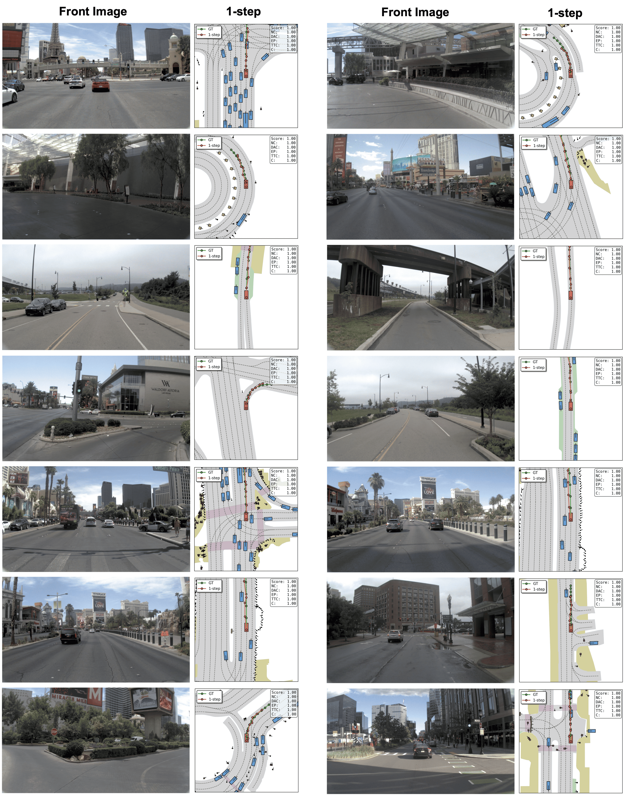
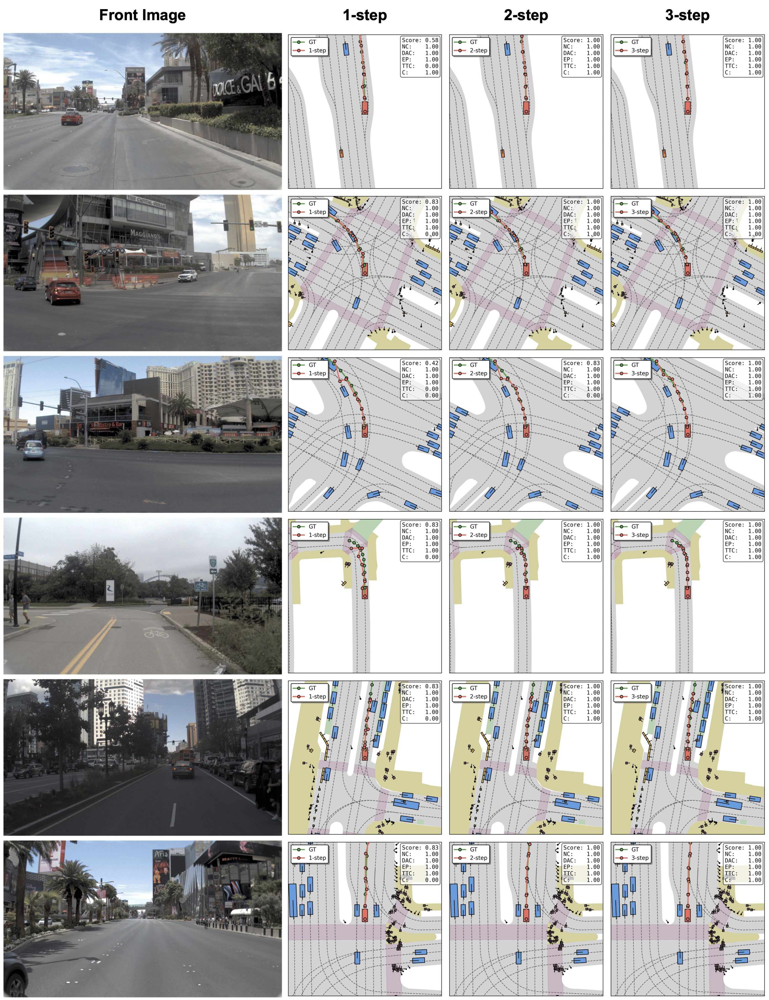
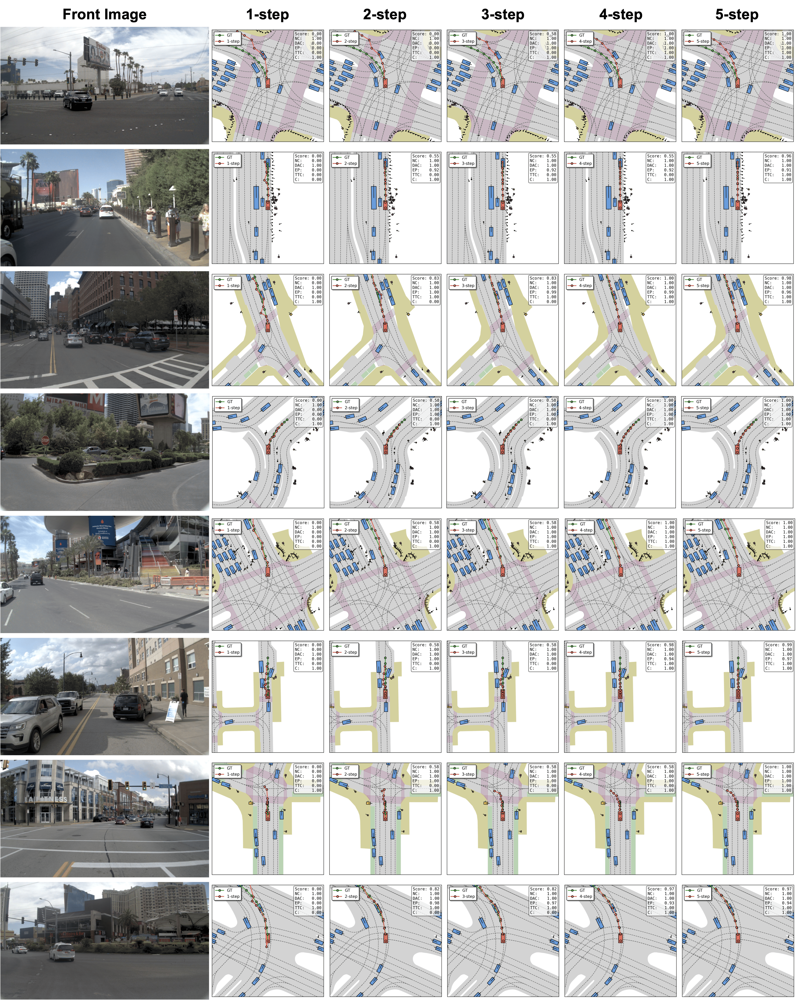

## Citation

Pengxiang Li, Yinan Zheng, Yue Wang, Huimin Wang, Hang Zhao, Jingjing Liu, Xianyuan Zhan, Kun Zhan, Xianpeng Lang.  
LiAuto + Tsinghua University.  
arXiv: https://arxiv.org/html/2509.20109v1

---

## Problem Statement

Imitation-learning-based VLA planners cannot inherently guarantee physical safety:
- Trajectories that are high-probability under the model may still violate drivable-area or collision constraints
- Rule-based anchor refinement (DiffusionDrive, Hydra-MDP) requires extensive human priors
- RL (GRPO-style) improves safety but demands unsafe online rollouts infeasible for real deployment
- Continuous diffusion guidance injects safety signals but requires expensive gradient computation

ReflectDrive addresses all three through **inference-time reflection in discrete token space** — gradient-free, parallelizable, and anchored to hard safety constraints.

---

## Architecture

*Figure 1: ReflectDrive Framework Overview. Left: BEV showing K goal candidates scored and NMS-filtered. Right: DLM backbone processes multi-view images + language + ego state; reflective inference produces a safe trajectory.*

### Backbone: LLaDA-V

Pre-trained **Diffusion Language Model** (masked discrete diffusion, not causal AR). Fine-tuned on driving planning datasets.

- **Inputs**: front, front-left, front-right cameras + navigation command (turn left / go straight / turn right) + ego state (speed, etc.)
- **Inputs encoding**: standard VLM vision encoder + text tokenizer
- **Training objective**: masked NLL — given a partially masked token sequence, predict original tokens at masked positions

### Trajectory Discretization

Each continuous 2D waypoint $(x, y)$ is independently quantized:
- Uniform 1D codebook $\mathcal{A} = \{a_1, \ldots\}$ over spatial range $[-M, M]$ with resolution $\Delta_g$
- Quantizer $\mathcal{Q}$ maps real value to nearest codebook token
- Each waypoint → token pair $(\mathbf{y}_{j,x}, \mathbf{y}_{j,y})$
- Full N-waypoint trajectory → flattened sequence $\mathbf{y} \in \mathcal{A}^{2N}$ of length $2N$

This is simpler than WAM-Flow's metric-aligned tokenizer (no triplet-margin loss) but supports the same inpainting mechanism.

### Training Loss

Standard masked diffusion NLL:
$$\mathcal{L}(\theta) = \mathbb{E}_{\mathbf{y},c,s,\mathbf{m}^{(s)}} \left[ -\sum_{i:\,m^{(s)}_i = 1} \log p_\theta(\mathbf{y}_i \mid \tilde{\mathbf{y}}^{(s)}, c, s) \right]$$

Classifier-free guidance (CFG) is used at inference.

---

## Reflective Inference

The key contribution. Two sequential phases, entirely gradient-free.

*Figure 2: Safety-Guided Regeneration Pipeline. Unsafe trajectory evaluated by Safety Scorer → earliest unsafe waypoint identified → local Manhattan search finds corrected token pair → safety anchor fixed → DLM inpaints surrounding tokens (green = anchored, gray = regenerated).*

### Scoring Functions

Three composable scoring functions (defined based on NAVSIM evaluation principles):

| Scorer | Scope | Returns |
|--------|-------|---------|
| **Global Scorer** $S_\text{global}(\tau)$ | Full trajectory | Overall quality; 0 if any critical violation |
| **Safety Scorer** $S_\text{safe}(\tau)$ | Per-waypoint | Safety oracle; identifies precise failure points |
| **Local Scorer** $S_\text{local}(a_x, a_y)$ | Single token pair | Evaluates candidate correction token on safety + coherence |

### Phase 1 — Goal-Conditioned Generation

**Motivation**: The local search in Phase 2 can only fix small deviations. Large-scale multimodal choices (different intersection turn) must be seeded at the goal level.

**Procedure**:
1. Sample terminal waypoint distribution $p_\theta(\mathbf{y}_N \mid c, s)$
2. Select top-$K'$ most probable candidates
3. Apply NMS with distance threshold $d_\text{NMS}$ → $K$ spatially diverse goals $\mathcal{G} = \{G_1, \ldots, G_K\}$:
$$\mathcal{G} = \text{NMS}\!\left(\text{TopK}_{K'}\!\left(p_\theta(\mathbf{y}_N \mid c, s)\right),\; d_\text{NMS},\; K\right)$$
4. For each $G_k$: inpaint full trajectory $\tau_k$ by conditioning on goal token + regenerating remaining $2N-2$ tokens
5. Score all K trajectories via $S_\text{global}$ → select best:
$$\tau^* = \operatorname*{arg\,max}_{\tau_k} S(\tau_k)$$

### Phase 2 — Safety-Guided Regeneration (Iterative)

**Motivation**: The selected $\tau^*$ may still violate physical constraints not captured at goal level.

**Per-iteration procedure**:
1. **Evaluate**: $S_\text{safe}$ scores each waypoint; find first unsafe index $t^*$ (below safety threshold)
2. **If safe**: terminate → return $\tau^*$
3. **Local search**: find improved token pair in Manhattan neighborhood $\mathcal{N}_\delta$ (typically $\delta \leq 10$):
$$(\mathbf{y}'_{t^*,x}, \mathbf{y}'_{t^*,y}) = \operatorname*{arg\,max}_{(a_x, a_y) \in \mathcal{N}_\delta(\mathbf{y}_{t^*,x}, \mathbf{y}_{t^*,y})} S_\text{local}(a_x, a_y)$$
4. **Fix anchor**: replace token at $t^*$ with corrected pair (safety anchor)
5. **Inpaint**: regenerate surrounding trajectory segments conditioned on the safety anchor — one diffusion pass restores global coherence
6. **Repeat** until safe or budget exhausted

**Key property**: most violations resolved within 1–3 iterations. The approach is designed for real-time performance.

---

## Model Variants

| Variant | Safety oracle | Interpretation |
|---------|--------------|----------------|
| ReflectDrive (w/o R.I.) | None (CFG only) | Base DLM with classifier-free guidance; no reflective inference |
| ReflectDrive | Constant-speed agents | Practical deployment model; oracle assumes obstacles move at constant speed |
| ReflectDrive† | GT ground-truth agents | Analytical upper bound; uses privileged agent state information |

The gap between ReflectDrive and ReflectDrive† quantifies oracle quality ceiling — how much safety performance depends on accurate agent trajectory prediction.

---

## Experiments

### Evaluation Protocol

- Benchmark: **NAVSIM** (navtest, 136 scenes)
- Primary metric: **PDMS** (NC × DAC × weighted aggregate of EP, TTC, Comf)
- Camera-only inputs (front + front-left + front-right)
- Comparison includes: vanilla E2E (UniAD, ParaDrive, Transfuser), augmented E2E with trajectory anchors (Hydra-MDP, DiffusionDrive, GoalFlow), VLA (AutoVLA)

### NAVSIM Closed-Loop Results (Table 1)

> **Note**: Table 1 numerical data is not rendered in the source markdown. The paper claims "near human-level closed-loop performance" and presents results surpassing AutoVLA (89.1 PDMS, prior VLA SOTA). Exact sub-metric breakdown (NC/DAC/TTC/Comf/EP) not captured.

Summary of comparison groups:

| Group | Representative | PDMS range |
|-------|---------------|------------|
| Vanilla E2E | UniAD, Transfuser | Low |
| Augmented E2E (anchors) | DiffusionDrive (88.1), GoalFlow | 88–89 |
| VLA (AR) | AutoVLA | 89.1 |
| **ReflectDrive** | w/o R.I. / base / GT | >89.1 (claimed) |

### Qualitative Safety Correction (goodcase.png)

*Figure 3 (qualitative): Top row — DAC violations (off-road / drivable area infringement) corrected by Safety-Guided Regeneration. Bottom row — TTC violations (near-collision with surrounding agents) corrected by S.G.R. BEV maps show before/after correction.*

### Iterative Refinement by Difficulty

The number of reflection iterations scales with scenario difficulty:

*Easy cases: 1 inference step sufficient. BEV shows clean trajectories on straightforward urban driving scenarios.*

*Medium cases: 1–3 steps. Progressive trajectory refinement visible across columns — earlier steps may clip road boundaries or cut corners; later steps conform to lane geometry.*

*Hard cases: up to 5 steps. Complex intersection maneuvers, tight turns, dense traffic. Trajectory requires multiple anchor-and-inpaint cycles to satisfy all safety constraints.*

---

## Key Design Decisions

### Why Discrete Diffusion vs. Continuous Diffusion?

Continuous diffusion (ReCogDrive) requires gradient computation for safety guidance — expensive and numerically unstable. Discrete token space enables:
- **Search**: brute-force enumeration of a small neighborhood $\mathcal{N}_\delta$
- **Inpainting**: fix some tokens, regenerate others in one forward pass
- **No gradients**: correction operates entirely through token replacement

### Why Masked Diffusion vs. DFM (WAM-Flow)?

Both operate over discrete token spaces, but use different generative dynamics:

| Aspect | ReflectDrive (masked diffusion) | WAM-Flow (DFM via CTMC) |
|--------|--------------------------------|--------------------------|
| Corruption process | BERT-style [MASK] tokens | CTMC Gibbs probability path |
| Velocity field | Fixed mask/unmask schedule | Learned geometry-aware rates |
| Inpainting | Native (fix unmasked, unmask rest) | Requires adapting CTMC boundary |
| Numerical tokenizer | Simple uniform codebook | Metric-aligned (triplet loss) |
| RL training | Not used (inference-time correction) | GRPO during training |
| Oracle at inference | Safety scorer (external) | PDMS reward (environment) |

ReflectDrive's masked diffusion provides inpainting "for free" — it is structurally identical to the training objective. This is the core architectural reason for choosing masked diffusion.

### Inpainting as Repair

The paper's core insight: **masked diffusion training = inpainting training**. A model trained to predict masked tokens can repair any partially-masked sequence. This allows external edits (safety anchor insertion) to be "healed" by one forward diffusion pass — the model interpolates context around the anchor point.

---

## Limitations

1. **Constant-speed oracle**: Base ReflectDrive assumes obstacles move at constant speed for safety scoring. Real-world dynamic agents reduce effective safety guarantees; gap to ReflectDrive† quantifies this.

2. **Local search ceiling**: Manhattan-$\delta$ search ($\delta \leq 10$) only makes small corrections. Fundamentally different trajectories must be seeded at the goal-generation stage — safety and diversity are architecturally decoupled.

3. **Same model for goal + trajectory**: The paper acknowledges a dedicated goal-generation model could improve goal diversity, but uses the same model for simplicity.

4. **No RL fine-tuning**: Compared to WAM-Flow and ReCogDrive (both use GRPO), ReflectDrive relies entirely on inference-time correction to compensate for IL's causal confusion limitations. This may set a ceiling on the base model's quality.

5. **Table 1 missing**: Numerical PDMS sub-metrics (NC/DAC/TTC/Comf/EP) not available from paper's markdown representation.

6. **NAVSIM-only evaluation**: No nuScenes open-loop, Carla, or other benchmark results.

7. **Quantization error**: Discrete codebook resolution trades off trajectory precision for search efficiency; ablation of this trade-off is not provided.

---

## Relationship to Other Papers

- **vs. ReCogDrive**: ReCogDrive uses continuous diffusion (DiT) + GRPO RL; ReflectDrive uses masked discrete diffusion + inference-time safety reflection. Both achieve safety improvement but via orthogonal mechanisms.
- **vs. WAM-Flow**: Both use discrete token planners. WAM-Flow uses CTMC-based DFM + GRPO; ReflectDrive uses masked diffusion + reflection. WAM-Flow optimizes during training; ReflectDrive optimizes during inference.
- **vs. DiffusionDrive**: DiffusionDrive uses trajectory anchors from clustering as initialization; ReflectDrive seeds diversity via NMS goal generation. Both aim to handle multimodal driving behaviors.
- **vs. AutoVLA**: AutoVLA is the prior VLA SOTA (89.1 PDMS, AR generation); ReflectDrive extends DLM planning with inference-time safety reflection and claims to exceed it.
